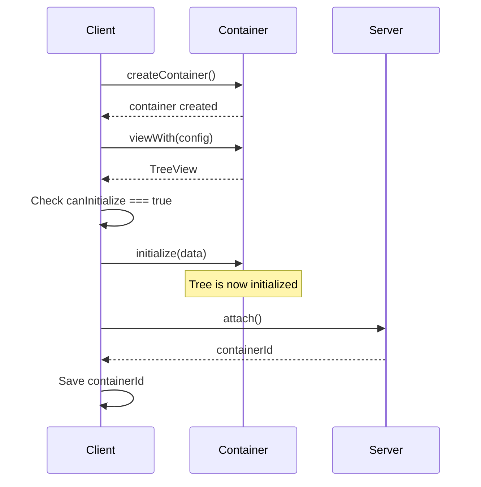
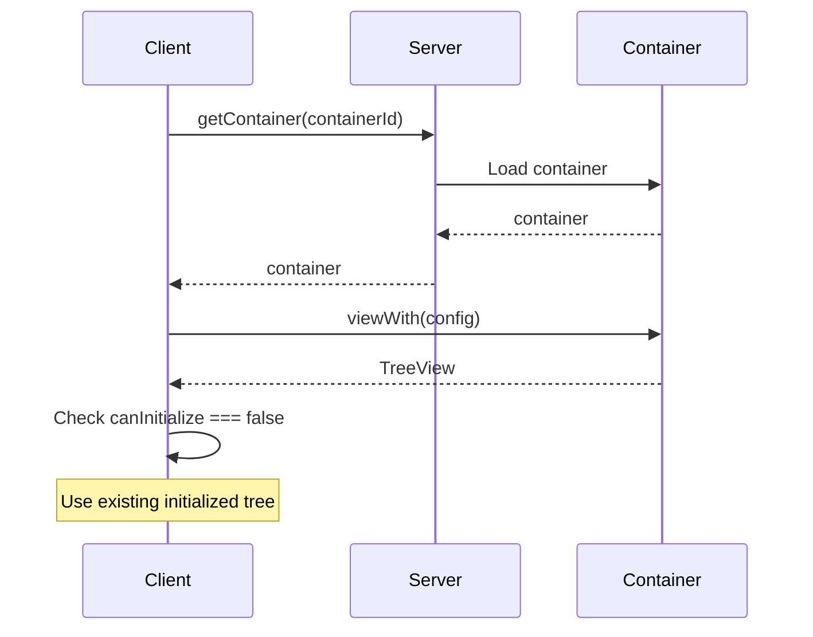

This guide describes the recommended initialization flow for `SharedTree` to avoid common pitfalls when creating or loading collaborative sessions.

## Overview

The most critical rule: **never initialize after [connecting to the container](../../build/containers.mdx#connecting-to-a-container)**.

Connecting before initializing creates a race condition: other clients can join, see an uninitialized tree, and send their own initialization operations. When the original client's operation is processed, all others are rejected, potentially causing data loss.

The solution: initialize **before** connecting when creating a new container. Use `compatibility.canInitialize` to validate assumptions and catch bugs early.

## Path 1: Creating a New Container

When creating a new container:

1. Create the container
2. Create a TreeView with `viewWith()`
3. **Check that `canInitialize` is `true`**, if not, something is wrong
4. Initialize the tree with initial data
5. Call `attach()` to connect the container and get its ID
6. Save the container ID for future sessions



### Why This Works

Initializing before `attach()` ensures the tree is fully ready before any other client can connect. The check for `canInitialize === true` acts as an assertion — if it's `false`, something went wrong during container creation.

## Path 2: Loading an Existing Container

When loading an existing container:

1. Load the container using its ID
2. Create a TreeView with `viewWith()`
3. **Check that `canInitialize` is `false`**, if not, something is wrong
4. Use the existing tree (already initialized by whoever created it)



### Why This Works

The check for `canInitialize === false` acts as an assertion — if it's `true`, the tree was never properly initialized before being shared.

## Complete Code Example

```typescript
export class CollaborationFluidClient {
	public async init(): Promise<TreeView<typeof AppData>> {
		// Specify the container ID in the page URL, e.g. "www.app.com/#1bf51ce6-7614-4871-9965-d02a4e8c4ad4"
		// If no ID is present in the URL (e.g. "www.app.com"), then create a new container with a new ID
    	const containerId = window.location.hash.substring(1);

		if (containerId.length === 0) {
			// Path 1: Creating a new container
			const container = await this.createFluidContainer();
			const view = container.initialObjects.appData.viewWith(AppDataTreeConfiguration);

			if (!view.compatibility.canInitialize) {
				throw new Error("The tree must be safe to initialize upon creation of the Fluid container");
			}

			view.initialize(new AppData([]));
			const fluidContainerId = await container.attach();
			window.location.hash = fluidContainerId;
			return view;
		} else {
			// Path 2: Loading an existing container
			const container = await this.loadFluidContainer(containerId);
			const view = container.initialObjects.appData.viewWith(AppDataTreeConfiguration);

			if (view.compatibility.canInitialize) {
				throw new Error("The tree should already be initialized if the Fluid container exists");
			}

			if (view.compatibility.canUpgrade) {
				// See [Schema Evolution](./schema-evolution/index.mdx) for instructions on how to handle schema changes in production applications.
			}

			return view;
		}
	}

	private async createFluidContainer(): Promise<IFluidContainer<typeof AppSchema>> {
		const client = this.initClient();
		const { container } = await client.createContainer(AppSchema, FluidCompatibilityMode);
		return container;
	}

	private async loadFluidContainer(containerId: string): Promise<IFluidContainer<typeof AppSchema>> {
		const client = this.initClient();
		const { container } = await client.getContainer(containerId, AppSchema, FluidCompatibilityMode);
		return container;
	}

	private initClient(): TinyliciousClient {
		return new TinyliciousClient({ connection: { port: 7070 } });
	}
}
```

## Key Takeaways

- Always initialize **before** calling `attach()` on new containers.
- Use `compatibility.canInitialize` as an assertion to detect incorrect state early.
- The two paths are mutually exclusive:
  - **Creation**: create → view → initialize → attach → save ID
  - **Loading**: load → view → use existing data

## See Also

- [SharedTree Quick Start](../../start/tree-start.mdx)
- [Containers](../../build/containers.mdx)
- [Schema Evolution](./schema-evolution/index.mdx)
