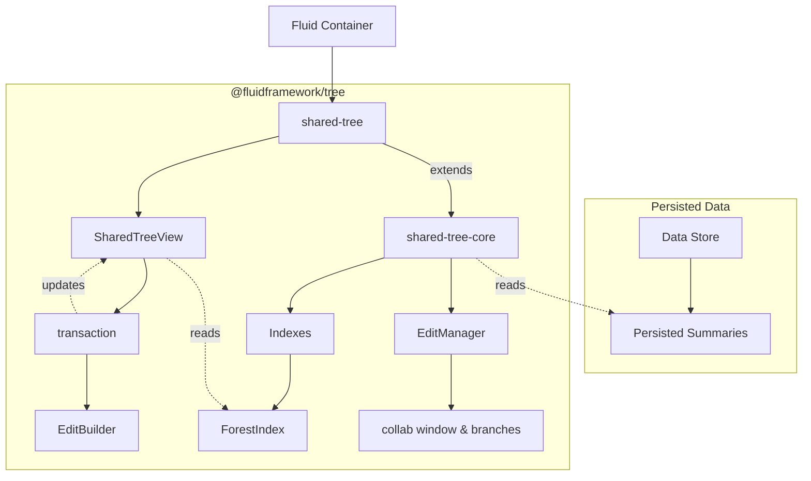
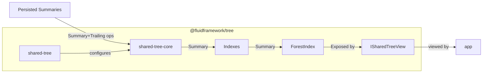
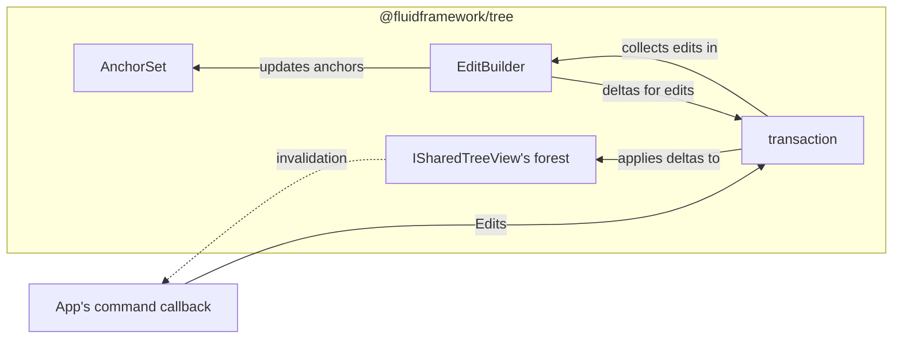
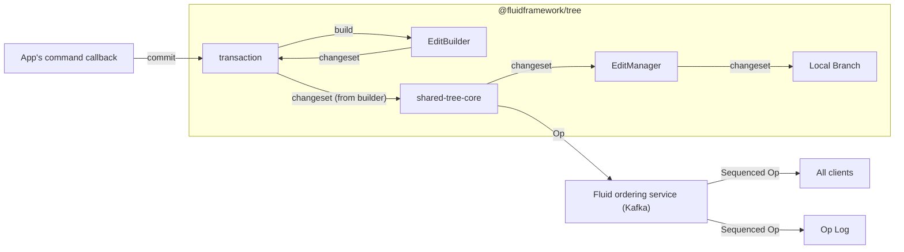
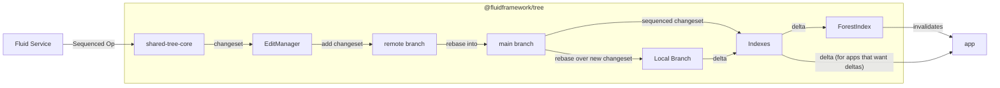
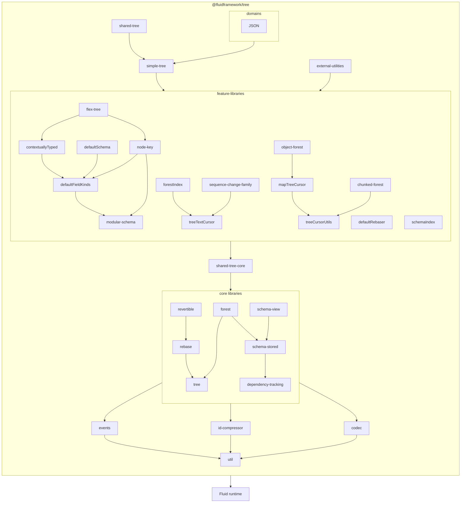

# @fluidframework/tree

A [tree](<https://en.wikipedia.org/wiki/Tree_(data_structure)>) data structure for the [Fluid Framework](https://fluidframework.com/).

To get started working with `SharedTree` in your application, read this [quick start guide](https://fluidframework.com/docs/start/tree-start/).

The contents of this package are also reported as part of the [`fluid-framework` package](https://www.npmjs.com/package/fluid-framework) which provides an alternative way to consume the functionality from this package.

[SharedTree Philosophy](./docs/SharedTree%20Philosophy.md) covers the goals of the SharedTree project,
and some of the implications of those goals for developers working on this package.

<!-- AUTO-GENERATED-CONTENT:START (LIBRARY_README_HEADER) -->

<!-- prettier-ignore-start -->
<!-- NOTE: This section is automatically generated using @fluid-tools/markdown-magic. Do not update these generated contents directly. -->

## Using Fluid Framework libraries

When taking a dependency on a Fluid Framework library's public APIs, we recommend using a `^` (caret) version range, such as `^1.3.4`.
While Fluid Framework libraries may use different ranges with interdependencies between other Fluid Framework libraries,
library consumers should always prefer `^`.

If using any of Fluid Framework's unstable APIs (for example, its `beta` APIs), we recommend using a more constrained version range, such as `~`.

## Installation

To get started, install the package by running the following command:

```bash
npm i @fluidframework/tree
```

## Importing from this package

This package leverages [package.json exports](https://nodejs.org/api/packages.html#exports) to separate its APIs by support level.
For more information on the related support guarantees, see [API Support Levels](https://fluidframework.com/docs/build/releases-and-apitags/#api-support-levels).

To access the `public` ([SemVer](https://semver.org/)) APIs, import via `@fluidframework/tree` like normal.

To access the `beta` APIs, import via `@fluidframework/tree/beta`.

To access the `alpha` APIs, import via `@fluidframework/tree/alpha`.

To access the `legacy` APIs, import via `@fluidframework/tree/legacy`.

## API Documentation

API documentation for **@fluidframework/tree** is available at <https://fluidframework.com/docs/apis/tree>.

<!-- prettier-ignore-end -->

<!-- AUTO-GENERATED-CONTENT:END -->

## Status

Notable considerations:

-   The persisted format is stable: documents created with released versions 2.0.0+ are fully supported long term.
-   All range changes are currently atomized: inserting/removing/moving multiple contiguous nodes is split into separate single-node edits. This affects merge behavior and performance for large array edits.
-   Some documentation (including this readme and [the roadmap](docs/roadmap.md)) may be out of date. The [API documentation](https://fluidframework.com/docs/api/v2/tree) derived from source code comments is more current.

More details on the development status of various features can be found in the [roadmap](docs/roadmap.md).

## Motivation

Many consumers across several companies have overlapping requirements that are best met by a shared, feature-rich tree DDS.
The current feature focus is on:

-   Semantics:
    -   High quality semantic merges, including moves of parts of sequences (called "slice moves").
    -   Transactionality.
    -   Support schema in a semantically robust way.
-   Scalability:
    -   Support for partial views: allow efficiently viewing and editing parts of larger datasets without downloading the whole thing.
    -   Ability to easily (sharing code with client) spin up optional services to improve scalability further (ex: server side summaries, indexing, permissions etc.)
    -   Efficient data encodings.
-   Expressiveness:
    -   Efficient support for moves, including moves of large sections of large sequences, and large subtrees.
    -   Support history operations (ex: undo and redo).
    -   Flexible schema system that has design patterns for making schema changes over time.
-   Workflows:
    -   Good support for offline.
    -   Optional support for branching and history.
-   Extensibility: It must be practical to accommodate future users with needs beyond what we can afford to support in the initial version. This includes needs like:
    -   New field kinds to allow data-modeling with more specific merge semantics (ex: adding support for special collections like sets, or sorted sequences)
    -   New services (ex: to support permissions, server side indexing etc.)

## What's missing from existing DDSes?

`directory` and `map` cannot guarantee tree well-formedness with the desired editing APIs (e.g., subsequence move), and cannot be practically extended to handle large data or schema efficiently.

`sequence` does not capture hierarchy or schema, does not handle partial views, and has merge resolution shortcomings that `tree` aims to improve.

`experimental/tree` lacks a built-in schema system, reducing data available for high-quality merges. Its merge resolution requires the whole tree in memory because it is based entirely on node identifiers (including transaction constraints that require reading large tree portions).

`experimental/PropertyDDS` has lower-quality merge logic (no efficient moves). While improvements are theoretically possible, it was decided to build this DDS from scratch, incorporating lessons from both `PropertyDDS` and `experimental/tree`.

## Why not a tree composed of existing DDSes?

Existing DDSes cannot support cross-DDS transactions: moving a sequence item from one DDS to another cannot be done atomically, so if the source conflicts, the destination cannot be updated or aborted. Cross-DDS moves are also less efficient than intra-DDS moves, and cross-DDS history or branching would require major framework changes. Per-DDS performance and storage overhead also makes a multi-DDS approach significantly more expensive.

This tree DDS can be thought of as combining Fluid Framework features (e.g., partial-view support) with DDS features (e.g., low per-item overhead, efficient sub-sequence moves, transactions). If successful, it may surface improved abstractions for hierarchical collaborative data structures (e.g., "field kinds") that could eventually move into the framework itself — making history, branching, transactional moves, and reduced overhead framework-level features.

From this perspective, `tree` is a proof of concept for abstractions that benefit from initial DDS-level implementation, delivering these capabilities to users faster than a framework-level approach would allow.

## Recommended Developer Workflow

This package supports the [standard Fluid Framework workflows](../../../README.md). For work limited to this package, there is a more streamlined option:

-   Follow the [Setup and Building](../../../README.md#setup-and-building) instructions.
-   Open [.vscode/Tree.code-workspace](.vscode/Tree.code-workspace) in VS Code and install the recommended test runner extension.
-   Build with `pnpm i && pnpm run build` in the `tree` directory.
-   After edits, run `pnpm run build` again.
-   Run and debug tests via the "Testing" panel in VS Code or the inline `Run | Debug` buttons (provided by the mocha extension).
    Note: the buttons do not trigger a build — always build first.

## Frequently asked questions

### Why can't I assign insertable content to a field?

``` typescript
import { SchemaFactory } from "@fluidframework/tree";

const factory = new SchemaFactory("com.fluidframework.faq");
class Empty extends factory.object("Empty", {}) {}
class Test extends factory.object("Test", { data: Empty }) {}
function set(node: Test) {
	node.data = {}; // Why does this not compile?
}
```

This is a [TypeScript limitation](https://github.com/microsoft/TypeScript/issues/43826) that makes it impossible to allow insertable content on setters while preserving strong getter types.

The workaround is to construct an unhydrated node explicitly:

``` typescript
node.data = new Empty({}); // unhydrated node type matches the getter return type
```

Insertable content still works in other contexts: nested inside other insertable content, in `ArrayNode` editing methods, and when initializing views:

``` typescript
const node = new Test({ data: {} }); // {} is implicitly constructed as Empty here
```

See [TreeNode remarks](https://fluidframework.com/docs/api/fluid-framework/treenode-class#treenode-remarks) for notes on explicit vs implicit node construction.

### Why is the only type TypeScript will let me provide as content for my field `undefined`?

An optional field allows `undefined` or whatever [`AllowedTypes`](https://fluidframework.com/docs/api/fluid-framework/allowedtypes-typealias) the field permits.
If the allowed types reduce to `never`, only `undefined` remains.
See the next question for why this can happen.

### Why is my insertable content getting typed as `never`?

This commonly occurs with [Input](https://fluidframework.com/docs/api/fluid-framework/input-typealias) types due to contravariance (see the linked docs).
The usual cause is insufficiently specific types when declaring a schema constant used later in the full schema.
For example:

```typescript
const itemTypes = [ItemA, ItemB]; // BAD: use `as const` to fix.
class Holder extends schemaFactory.object("Holder", { item: itemTypes }) {}
const holder = new Holder({ item: new ItemA({ a: 42 }) }); // Type 'ItemA' is not assignable to type 'never'.ts(2322)
```

Fix by using `as const` to capture a more specific type:

```typescript
const itemTypes = [ItemA, ItemB] as const; // Fixed
class Holder extends schemaFactory.object("Holder", { item: itemTypes }) {}
const holder = new Holder({ item: new ItemA({ a: 42 }) });
```

## Architecture

This section covers the internal structure of the Tree DDS.
Throughout, "the application" refers to the consumer of this package — typically client-side business logic or a view layer, but possibly a headless service.

### Ownership and Lifetimes

This diagram shows the ownership hierarchy during a transaction with solid arrows, and some important references with dashed arrows:



`tree` is a DDS: it stores persisted data in a Fluid Container and is owned by that container.
When no container references remain, it may be garbage collected.

[`shared-tree-core`](./src/shared-tree-core/README.md) is composed of a collection of indexes (similar to a database), whose data is persisted as part of the container summary.
`shared-tree-core` owns these indexes and is responsible for populating them from summaries and updating them during summarization.

See [indexes and branches](./docs/main/indexes-and-branches.md) for details on how this interacts with branches.

Applications access tree data through a [`TreeView`](./src/simple-tree/tree.ts), which exposes application-facing APIs built on the [`view-schema`](./src/core/schema-view/README.md).
Views may also hold application state including:

-   [`view-schema`](./src/core/schema-view/README.md)
-   adapters for out-of-schema data (TODO)
-   hints for which subtrees to keep in memory (TODO)
-   pending transactions
-   application callback / event registrations

Views subscribe to events from `shared-tree`, so they must be explicitly disposed to avoid leaks.

Transactions are created by `Tree.runTransaction` and are currently synchronous.
Async transaction support (with application-managed lifetimes bounded by the view lifetime) may be added in the future.

### Data Flow

#### Viewing



[`shared-tree`](./src/shared-tree/) configures [`shared-tree-core`](./src/shared-tree-core/README.md) with a set of indexes.
`shared-tree-core` downloads summary data from the Fluid Container and feeds it (and subsequent edits) into the indexes.
`shared-tree` then constructs the default view, from which the application reads data.

Applications typically use one of two patterns:

-   **Invalidation**: Read tree data to build the view. Register invalidation callbacks for observed parts. On invalidation, re-read the tree to reconstruct affected parts.
-   **Delta**: Read tree data to build the view. Register delta callbacks for observed parts. On delta, update the view in place.

<!-- TODO: Eventually these patterns should be mixable for different subtrees, with scoped deltas. For now deltas are global. -->

The first pattern is implemented using the second: tree data is stored in a [`forest`](./src/core/forest/README.md) that updates itself via deltas. The second pattern opts into a domain-specific tree representation; the first uses the platform-provided general-purpose representation, which is simpler but may have some performance overhead.

Views hold references to parts of the tree using "anchors", which have well-defined behavior across edits.

### Editing

Solid arrows show edit-related data flow; dotted arrows show view updates in response.

Editing during a transaction:



The application uses its view to locate edit targets, then passes a "command" to the view, which creates a transaction to run it.
The command can interactively edit the tree. Internally, the transaction implements edits by creating changes, each processed two ways:

-   The change is converted to a delta applied to the forest and any anchors, letting the application read the updated tree immediately.
-   The change is accumulated in `EditBuilder` to build the final edit sent to Fluid.

When the command ends, the transaction rolls back to leave the forest clean.
If the command succeeded, a `changeset` is built from `EditBuilder` and encoded as a Fluid Op.
The view rebases the op if other ops arrived during the (async) transaction, then sends it to `shared-tree-core`, which submits it to Fluid.
This creates a local op and a corresponding delta, which flows to the indexes, updating `ForestIndex` and any delta subscribers.

Transaction completion diagram (rollback, forest/AnchorSet updates, and the usually-skipped changeset rebase step are omitted for clarity):



When the op is sequenced, `shared-tree-core` receives it back, rebases it as needed, and sends another delta to the indexes:



### Schema Evolvability

Application authors often need to change their schema — to add features or restructure content. Before doing so, they must account for compatibility constraints: there is no way to guarantee all open documents use the new schema, or that all collaborating clients run the same code version. Two clients with different schemas attempting to collaborate can cause problems.

Applications must therefore plan policies for which document versions their code supports.

See [Schema Evolution](./docs/user-facing/schema-evolution.md) for a comprehensive treatment.

### Dependencies

`@fluidframework/tree` depends on the Fluid runtime (`@fluidframework/*`) and is consumed directly by applications.
Its implementation is split into several parts with carefully controlled dependencies to keep the codebase maintainable.
The guiding principles are:

-   **Avoid cyclic dependencies**: Cycles make incremental learning and replacement harder, and can cause runtime initialization issues.

-   **Minimize coupling**: Reduce the number and complexity of dependency graph edges — e.g., by making components generic rather than depending on concrete types, or merging tightly coupled components.

-   **Reduce transitive dependencies**: Keep each component's total dependency count small, at both the module and object level. In particular, avoid dependencies on stateful systems from code with complex conditional logic. For example, in [rebase](./src/core/rebase/README.md), `Rebaser` (stateful) is not depended on by the rebase policy. Instead, policy lives behind the `ChangeRebaser` interface as pure functions — making it easy to test in isolation. If policy lived in `Rebaser` subclasses, it would be much harder to test.

    Reducing required dependencies for specific scenarios also enables tree-shaking and optional features. `shared-tree-core` exemplifies this: it runs with no indexes and a trivial change family, giving it very few required dependencies. Interfaces (e.g., [`ChangeFamily`](./src/core/change-family/README.md)) and registries (e.g., `FieldKinds`, `shared-tree-core`'s indexes) support this via dependency injection. This simplifies reasoning, improves testability, and makes feature lifecycle management (pre-release, stabilization, deprecation, separate package extraction) straightforward.

These approaches have led to a dependency structure that looks roughly like the diagram below.
In this diagram, some dependency arrows for dependencies which are already included transitively are omitted.



## Open Design Questions

The issues below affect the architectural role of top-level modules and will likely require changes to the architecture described above when resolved.
Smaller, localized issues should be documented closer to the relevant code.

### How should specialized sub-tree handling compose?

Applications need a domain model that can mix tree nodes with custom implementations.
Custom implementations should be projectable from flex trees or forest content (via cursors), and updatable via either regeneration or delta.
This is important for performance and scalability, and may also be the mechanism for virtualization (e.g., un-downloaded subtrees as a custom representation).

<!-- AUTO-GENERATED-CONTENT:START (README_FOOTER) -->

<!-- prettier-ignore-start -->
<!-- NOTE: This section is automatically generated using @fluid-tools/markdown-magic. Do not update these generated contents directly. -->

## Minimum Client Requirements

These are the platform requirements for the current version of Fluid Framework Client Packages.
These requirements err on the side of being too strict since within a major version they can be relaxed over time, but not made stricter.
For Long Term Support (LTS) versions this can require supporting these platforms for several years.

It is likely that other configurations will work, but they are not supported: if they stop working, we do not consider that a bug.
If you would benefit from support for something not listed here, file an issue and the product team will evaluate your request.
When making such a request please include if the configuration already works (and thus the request is just that it becomes officially supported), or if changes are required to get it working.

### Supported Runtimes

-   NodeJs ^20.10.0 except that we will drop support for it [when NodeJs 20 loses its upstream support on 2026-04-30](https://github.com/nodejs/release#release-schedule), and will support a newer LTS version of NodeJS (22) at least 1 year before 20 is end-of-life. This same policy applies to NodeJS 22 when it is end of life (2027-04-30).
    -   Running Fluid in a Node.js environment with the `--no-experimental-fetch` flag is not supported.
-   Modern browsers supporting the es2022 standard library: in response to asks we can add explicit support for using babel to polyfill to target specific standards or runtimes (meaning we can avoid/remove use of things that don't polyfill robustly, but otherwise target modern standards).

### Supported Tools

-   TypeScript 5.4:
    -   All [`strict`](https://www.typescriptlang.org/tsconfig) options are supported.
    -   [`strictNullChecks`](https://www.typescriptlang.org/tsconfig) is required.
    -   [Configuration options deprecated in 5.0](https://github.com/microsoft/TypeScript/issues/51909) are not supported.
    -   `exactOptionalPropertyTypes` is currently not fully supported.
        If used, narrowing members of Fluid Framework types types using `in`, `Reflect.has`, `Object.hasOwn` or `Object.prototype.hasOwnProperty` should be avoided as they may incorrectly exclude `undefined` from the possible values in some cases.
-   [webpack](https://webpack.js.org/) 5
    -   We are not intending to be prescriptive about what bundler to use.
        Other bundlers which can handle ES Modules should work, but webpack is the only one we actively test.

### Module Resolution

[`Node16`, `NodeNext`, or `Bundler`](https://www.typescriptlang.org/tsconfig#moduleResolution) resolution should be used with TypeScript compilerOptions to follow the [Node.js v12+ ESM Resolution and Loading algorithm](https://nodejs.github.io/nodejs.dev/en/api/v20/esm/#resolution-and-loading-algorithm).
Node10 resolution is not supported as it does not support Fluid Framework's API structuring pattern that is used to distinguish stable APIs from those that are in development.

### Module Formats

-   ES Modules:
    ES Modules are the preferred way to consume our client packages (including in NodeJs) and consuming our client packages from ES Modules is fully supported.
-   CommonJs:
    Consuming our client packages as CommonJs is supported only in NodeJS and only for the cases listed below.
    This is done to accommodate some workflows without good ES Module support.
    If you have a workflow you would like included in this list, file an issue.
    Once this list of workflows motivating CommonJS support is empty, we may drop support for CommonJS one year after notice of the change is posted here.

    -   Testing with Jest (which lacks [stable ESM support](https://jestjs.io/docs/ecmascript-modules) due to [unstable APIs in NodeJs](https://github.com/nodejs/node/issues/37648))

## Contribution Guidelines

There are many ways to [contribute](https://github.com/microsoft/FluidFramework/blob/main/CONTRIBUTING.md) to Fluid.

-   Participate in Q&A in our [GitHub Discussions](https://github.com/microsoft/FluidFramework/discussions).
-   [Submit bugs](https://github.com/microsoft/FluidFramework/issues) and help us verify fixes as they are checked in.
-   Review the [source code changes](https://github.com/microsoft/FluidFramework/pulls).
-   [Contribute bug fixes](https://github.com/microsoft/FluidFramework/blob/main/CONTRIBUTING.md).

Detailed instructions for working in the repo can be found in the [Wiki](https://github.com/microsoft/FluidFramework/wiki).

This project has adopted the [Microsoft Open Source Code of Conduct](https://opensource.microsoft.com/codeofconduct/).
For more information see the [Code of Conduct FAQ](https://opensource.microsoft.com/codeofconduct/faq/) or contact [opencode@microsoft.com](mailto:opencode@microsoft.com) with any additional questions or comments.

This project may contain Microsoft trademarks or logos for Microsoft projects, products, or services.
Use of these trademarks or logos must follow Microsoft’s [Trademark & Brand Guidelines](https://www.microsoft.com/trademarks).
Use of Microsoft trademarks or logos in modified versions of this project must not cause confusion or imply Microsoft sponsorship.

## Help

Not finding what you're looking for in this README? Check out [fluidframework.com](https://fluidframework.com/docs/).

Still not finding what you're looking for? Please [file an issue](https://github.com/microsoft/FluidFramework/wiki/Submitting-Bugs-and-Feature-Requests).

Thank you!

## Trademark

This project may contain Microsoft trademarks or logos for Microsoft projects, products, or services.

Use of these trademarks or logos must follow Microsoft's [Trademark & Brand Guidelines](https://www.microsoft.com/en-us/legal/intellectualproperty/trademarks/usage/general).

Use of Microsoft trademarks or logos in modified versions of this project must not cause confusion or imply Microsoft sponsorship.

<!-- prettier-ignore-end -->

<!-- AUTO-GENERATED-CONTENT:END -->
