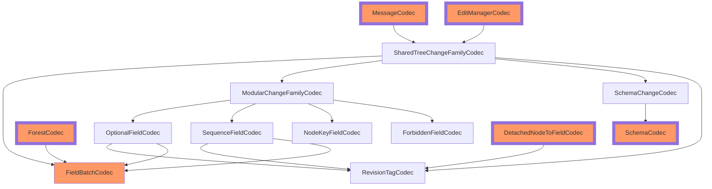

# Compatibility

Concrete guidelines and strategies for organizing code that impacts SharedTree's persisted format.

## Prerequisites

Read [this document](../../../../../packages/dds/SchemaVersioning.md) for general best practices on persisted data in Fluid Framework. Most recommendations here follow directly from those best practices.

## What State is Persisted?

A DDS's persisted format covers its summary format, its ops (due to [trailing ops](../../../README.md)), and transitively referenced structured blob data.

Since documents are stored outside Fluid control, DDSes commit to backwards compatibility of their format permanently.

## Format Management

The persisted format version should be a configuration option in `SharedTreeFactory`, giving application authors control over rollout of format changes (which require code saturation of a prior version) and letting the container author (rather than the host) control the data model.

In the SharedTree MVP, no mechanism for safely changing the persisted format version currently exists, but one is feasible to add. Specifying the version explicitly in configuration sets us up for this. Prior art: `@fluid-experimental/tree`'s [format-breaking migration strategy](../../../../../experimental/dds/tree/docs/Breaking-Change-Migration.md).

## Code Organization

Each part of SharedTree contributing to the persisted format should define:

1. Types for the _in-memory format_ needed to load or work with its data
2. Versioned _persisted formats_ for all supported (current and past) formats
3. Either an `IJsonCodec` transcoding between in-memory and a specific persisted format, or an `ICodecFamily` of such codecs (for multiple versions)

File naming conventions:
- In-memory format → `*Types.ts`
- Persisted format → `*Format.ts`
- Codecs → `*Codec.ts` / `*Codecs.ts`

Consistent naming makes format changes obvious at review time. Primitive schemas used in persisted formats but not defining formats (e.g., branded strings) can go where convenient.

Codec guidelines:
- Codec logic should be self-contained: all imports should be `import type`, or from another persisted format file. Imports from Fluid Framework libraries with equivalent guarantees (e.g., `SummaryTreeBuilder`) are also acceptable.
- Expose the minimal necessary set of types.
- Encoding: include only necessary object properties. **Avoid object spread.**
- Decoding: validate that data is not malformed (see [Encoding Validation](#encoding-validation)).
- Storage format types (other than primitives) must never appear in the public API.

> Note: due to API-extractor implementation details, typebox schemas for primitive types _cannot_ share a name with the primitive type — both the value and the type are exported under the same name even with `export type`. For example, the typebox schema for `ChangesetLocalId` is `ChangesetLocalIdSchema`.

## Encoding Validation

Thoroughly validating encoded formats and failing fast reduces data corruption risk: it's much easier to fix documents when incompatible clients haven't also modified them.

Encoded data formats should declare JSON schemas for runtime validation. We use [typebox](https://github.com/sinclairzx81/typebox) for this (its API closely matches TypeScript's expressiveness).

Whether to validate is a policy choice left to SharedTree users (validation incurs runtime and bundle-size costs). This will likely be configurable in `SharedTreeFactory` via a `JsonValidator`. It doesn't need to be persisted and can differ between collaborating clients without issue. An out-of-the-box `JsonValidator` backed by Typebox is provided; application authors may implement their own.

## Test Strategy

When adding new persisted configuration, consider three dimensions:

1. SharedTree works correctly for all configurations when collaborating with similarly configured instances.
2. SharedTree is compatible with clients using different source code versions (and documents those clients create).
3. SharedTree can correctly execute document upgrade processes (once supported).

### Configuration Unit Tests

Each codec family should have unit tests verifying round-trip encoding/decoding of the in-memory representation. When adding a new codec version, augment the test data to achieve 100% coverage on the new version.

If the configuration impacts more than just encoding, add unit tests for all affected components. Example: a flag controlling attribution storage should have tests verifying that ops produce correct attribution on affected tree parts.

Example: [experimental/dds/tree2/src/test/feature-libraries/editManagerCodecs.spec.ts](../../src/test/feature-libraries/editManagerCodecs.spec.ts)

### Multiple-Configuration Functional Tests

Once multiple persisted formats are supported, a small set of functional acceptance tests (e.g., `sharedTree.spec.ts`) should run across broader sets of configurations. Use `generatePairwiseOptions` to mitigate combinatorial explosion.

These tests verify that SharedTree works when initialized with a given configuration collaborating with instances using the same configuration. They detect basic codec defects and problems unrelated to backwards compatibility. Fuzz tests should also cover a variety of valid configurations.

### Snapshot Tests

Snapshot tests verify that documents produced by one version of the code remain usable in another. Implementation: write code to generate fixed "from scratch" documents, source-control their serialized summaries, then verify that:

1. The current code serializes each document to exactly match the older serialization.
2. The current code can load documents written by older code.

Examples:
- [Legacy SharedTree](../../../../../experimental/dds/tree/src/test/Summary.tests.ts)
- [Sequence / SharedString](../../../sequence/src/test/snapshotVersion.spec.ts)
- [e2e Snapshot tests](../../../../test/snapshots/README.md)

The first two generate documents by calling DDS APIs directly. The e2e tests serialize the op stream alongside snapshots and replay it, enabling verification that runtime behavior matches between old and current code.

> Note: Different snapshots may produce logically equivalent DDSes at load time (e.g., Matrix permutes permutation vectors and cell data, which doesn't change logical content). Runtime equivalence checks give friendlier error messages in these cases.

Tree2's full-scale snapshot tests: [experimental/dds/tree2/src/test/snapshots/summary.spec.ts](../../src/test/snapshots/summary.spec.ts). Smaller-scale snapshot tests (e.g., just `SchemaIndex`) are nearby.

# Implementation Specifics

SharedTree's codecs are composed in layers consistent with SharedTree's architecture, enabling unit testing of individual format portions. The downside: maintaining backwards compatibility is more complex, as not all codecs in the composition provide explicit versions.

The following diagram shows _runtime dependencies_ of the codec hierarchy for SharedTree's original persisted format.

Large borders = top-level codecs (directly define a summary blob or op format). Orange = explicitly versioned.

> Field kind codecs are corecursive with `ModularChangeset`'s codec in the encoded data. This doesn't significantly affect guidance around updating the persisted format.

| Codec (chart entry)                                                                           | In-memory type                  |
| --------------------------------------------------------------------------------------------- | ------------------------------- |
| [RevisionTagCodec](../../src/core/rebase/revisionTagCodec.ts)                                 | RevisionTag                     |
| [SchemaCodec](../../src/feature-libraries/schema-index/codec.ts)                              | TreeStoredSchema                |
| [SchemaChangeCodec](../../src/feature-libraries/schema-edits/schemaChangeCodecs.ts)           | SchemaChange                    |
| [FieldBatchCodec](../../src/feature-libraries/chunked-forest/codec/codecs.ts)                 | FieldBatch                      |
| [ForestCodec](../../src/feature-libraries/forest-summary/codec.ts)                            | FieldSet                        |
| [MessageCodec](../../src/shared-tree-core/messageCodecs.ts)                                   | DecodedMessage<TChangeset>      |
| [SharedTreeChangeFamilyCodec](../../src/shared-tree/sharedTreeChangeCodecs.ts)                | SharedTreeChange                |
| [EditManagerCodec](../../src/shared-tree-core/editManagerCodecs.ts)                           | SummaryData<TChangeset>         |
| [ModularChangeFamilyCodec](../../src/feature-libraries/modular-schema/modularChangeCodecs.ts) | ModularChange                   |
| [OptionalFieldCodec](../../src/feature-libraries/optional-field/optionalFieldCodecs.ts)       | OptionalChangeset<TChildChange> |
| [SequenceFieldCodec](../../src/feature-libraries/sequence-field/sequenceFieldCodecs.ts)       | Changeset<TChildChange>         |
| [NodeKeyFieldCodec](../../src/feature-libraries/default-schema/noChangeCodecs.ts)             | N/A                             |
| [ForbiddenFieldCodec](../../src/feature-libraries/default-schema/noChangeCodecs.ts)           | N/A                             |
| [DetachedNodeToFieldCodec](../../src/core/tree/detachedFieldIndexCodec.ts)                    | DetachedFieldSummaryData        |

Because all data is versioned at the top level, non-explicitly-versioned codecs' versions are implicitly covered by the top-level version. For example, a format change in `SchemaChangeCodec` can be implemented by adding a new version to its nearest explicitly versioned consumers (`MessageCodec` and `EditManagerCodec`), which use new code only to pass the right version context down to `SchemaChangeCodec`.

## Auditing Codec Resolution

The relationship between top-level `SharedTreeFormatVersion` values and the many available codec versions can be hard to trace. Use `getCodecTreeForSharedTreeFormat` in [sharedTree.ts](../../src/shared-tree/sharedTree.ts) to audit these relationships. Dependency snapshots are captured in the ["SharedTree Codecs"](../../src/test/shared-tree/sharedTreeCodecs.spec.ts) test suite and can be inspected [on disk](../../src/test/snapshots/codec-tree/SharedTreeFormatVersion.v1.json).

## Current Code Guidelines

**Explicitly versioned codecs** should export a codec that accepts a write version and supports reading all supported versions.

**Implicitly versioned codecs** should export a codec family, enabling consumers to resolve the appropriate implicit version using their own versioning information.

Example — breaking change in `SchemaChangeCodec`:

1. Add the new version to `SchemaChangeCodec` and include it in the exported codec family.
2. Add a new version of `SharedTreeChangeFamilyCodec` that uses the new `SchemaChangeCodec`.
3. Add new versions of `EditManagerCodec` and `MessageCodec` using the new `SharedTreeChangeFamilyCodec`.
4. Add a new `SharedTreeFormatVersion` write version that creates edit manager and message codecs of the appropriate versions; document code saturation requirements before it can be used.

## Example: New Format for Optional-Field

A new format was introduced in [this PR](https://github.com/microsoft/FluidFramework/pull/20341).

> This PR should have also started writing the new format in messages; that was instead done shortly after in [this commit](https://github.com/microsoft/FluidFramework/commit/0fafbebcd3324fc481bd8464f09ab15d595b4a57).

The format was exposed as a user option in [this PR](https://github.com/microsoft/FluidFramework/pull/20615). Delaying exposure in `SharedTreeFormatVersion` allows iteration on the new format before committing to permanent compatibility.

## Example: New Schema Format

A new schema format and codec were introduced as part of the persisted metadata feature in [this PR](https://github.com/microsoft/FluidFramework/pull/24812). At a high level:

- Add schema FormatV2 and its codec
- Add a new SharedTree format version
- Simple-tree changes
- Feature flag for enabling SharedTree Format v5

The PR description breaks down the changes in each area.

## Possible Improvements

The code change size for a new format currently scales with the depth of the implicitly versioned codec in the composition hierarchy. An alternative: resolve all implicitly versioned codecs eagerly and pass this through to all codecs. This removes the need for intermediate map entries but makes re-layering codec composition harder.

Another option: lazily create codecs for a given version. This would be a straightforward change to `makeCodecFamily`'s API.
