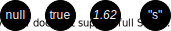
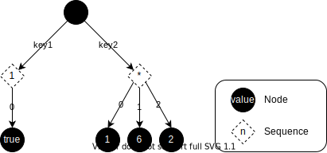
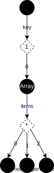
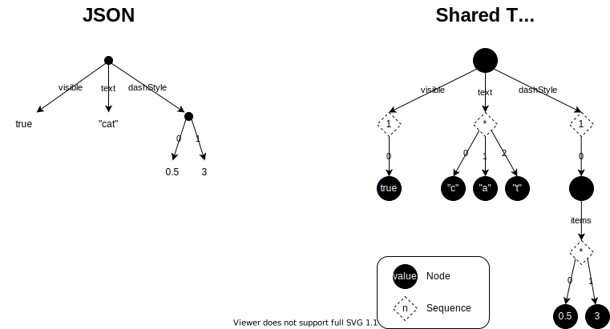

# Data Model

## Introduction

How tree data is conceptually organized in SharedTree, primarily for Fluid developers. Advanced users implementing specialized APIs (see [#8989](https://github.com/microsoft/FluidFramework/issues/8989)) may also find this useful.

The SharedTree data model is related to but distinct from the in-memory representation, network-serialized format, and persisted storage format. Each is a specific encoding of the data model; the model itself is not concerned with byte-level representation (see [#10034](https://github.com/microsoft/FluidFramework/issues/10034)).

## Requirements

### JSON Interoperability

SharedTree's data model is tree-structured. Since JSON is the lingua franca of the web, the data model must:

1. Efficiently and losslessly encode JSON (with minor caveats below).
2. Justify any deviations from JSON.

The data model must express the following naturally:

-   Object-like records of named properties
-   Array-like sequences of consecutive items (non-sparse)
-   null, true/false, finite numbers (f64), and strings

#### Potential JSON Caveats

##### Arbitrary Precision Numbers

JSON allows arbitrary-precision numbers, but `JSON.parse()` uses IEEE 64-bit float. We don't currently need to preserve arbitrary precision in M1.

##### Reserved Keys

SharedTree's data model is a superset of JSON and includes special fields for ids and types. Projecting to JSON requires reserved keys or a reserved key prefix for these.

##### Primitives with Ids and Augmentations

JSON primitives (numbers, booleans) can't carry fields. To preserve ids and augmentations on primitives, they must be wrapped in objects using the reserved type field to identify the encoded primitive.

### Durable References

The data model must support inexpensive durable references to nodes — for use cases like "share link" URLs and graph-like relationships.

### Schema

The data model is schema-agnostic but must encode enough information for a schema-on-write system to efficiently validate data (see #9282).

### Augmentation

Collaborators must be able to attach extra-schema data to the tree in a way that is ignored (but preserved) by clients unaware of the augmentation.

## Model

### Node

Each addressable piece of data is a tree **_node_**. An implicit root node serves as the initial insertion point for application-constructed trees.

<figure align="center">
  
  <figcaption>Figure: Implicit root node</figcaption>
</figure>

The root node may not be moved/removed and has a well-known identity, but otherwise is indistinguishable from other tree nodes.

### Value

Each tree node has an optional **_value_**.
Values are used to store scalar data, such as numbers and booleans.

<figure align="center">
  
  <figcaption>Figure: Nodes with values</figcaption>
</figure>

From the data model's perspective, values are [**_opaque_**](https://en.wikipedia.org/wiki/Opaque_data_type), immutable byte sequences. In practice they are Fluid [**_serializable_**](https://github.com/microsoft/FluidFramework/blob/main/packages/runtime/datastore-definitions/src/serializable.ts) types interpreted via schema.

### Field

Each node has zero or more fields. Each **_field_** represents one relationship between a parent node and an ordered **_sequence_** of one or more children.

<figure align="center">
  
  <figcaption>Figure: A parent node with two fields</figcaption>
</figure>

Fields are distinguished by a **_key_** — opaque byte sequences from the data model's perspective. In practice, dynamic keys are string literals; static keys are schema-declared identifiers.

### Sequences

SharedTree makes no distinction between single-child and multi-child fields. All fields are ordered collections; schema restricts multiplicity (optional, single, or multiple).

#### Implicit Sequences

When mapping to conventional programming languages, it's sometimes helpful to think of each field as pointing to an **_implicit sequence_** object.

<figure align="center">
  
  <figcaption>Figure: Visualizing implicit sequence of 'key' field</figcaption>
</figure>

Sequences are not tree nodes and are not directly addressable. The field+sequence combination is implicitly created on first insert, implicitly deleted on last remove, and is only referenced via parent node + field key.

#### Explicit Arrays

Most languages use an explicit array object with identity, direct addressability, and moveability. To model this in SharedTree, introduce a node between the parent and items.

<figure align="center">
  
  <figcaption>Figure: 'key' field points to an explicit array node</figcaption>
</figure>

### Special Fields

Special fields have reserved keys, are universally available on all nodes regardless of schema, and cannot be targeted by normal tree operations.

#### Type

An optional _type_ field supports nominal typing; its value is the unique schema type identifier. In the data model abstraction the value is an opaque byte sequence, but a set of well-known types (_boolean_, _number_, etc.) are transparent to the implementation.

#### Id

An optional _id_ field supports durable node references. When present, SharedTree maintains a bidirectional _id_ ⟷ _node_ index for efficient lookup — the building block for "share link" URLs and graph-like references. Applications choose which nodes receive ids due to the index maintenance cost.

## JSON Comparison

The below diagram highlights the differences between the JSON data model and the SharedTree data model using the following snippet:

```json
{
	"visible": true,
	"text": "cat", // String uses an implicit sequence
	"dashStyle": [0.5, 3] // Array uses an explicit tree node
}
```

<figure align="center">
  
  <figcaption>Figure: JSON and SharedTree</figcaption>
</figure>

Of note:

-   Scalar values are represented by tree nodes and consequently have a durable identity.
-   The 'visible' field is a sequence, even though it is constrained by schema to only contain a single value.
-   The 'text' field leverages its implicit sequence to represent the letters of "cat" as individual nodes, allowing the text to be collaboratively edited in the same way as array.
-   The 'dashStyle' field points to an extra node that represents the array object, which in turn contains the array items.

# Appendix A: Notes

-   We chose the term 'field' because it is convenient to have a term that is distinct from the 'properties' that result when the domain model is projected to an API
    ('field' also happens to align with GraphQL).
-   We chose the term 'key' because it sounds more opaque than 'name' or 'label', both of which conjure the notion of something that is human readable.
