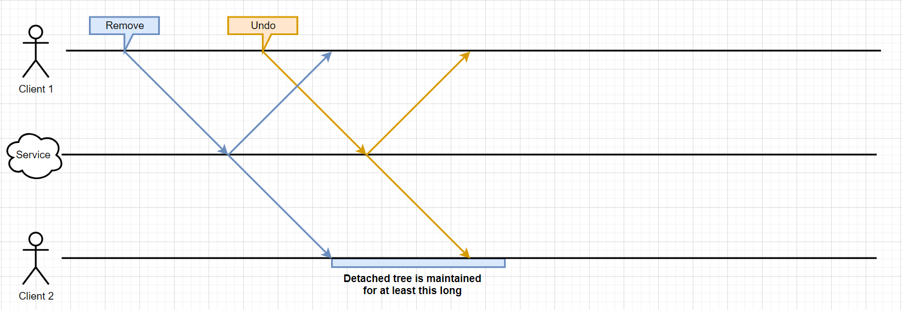
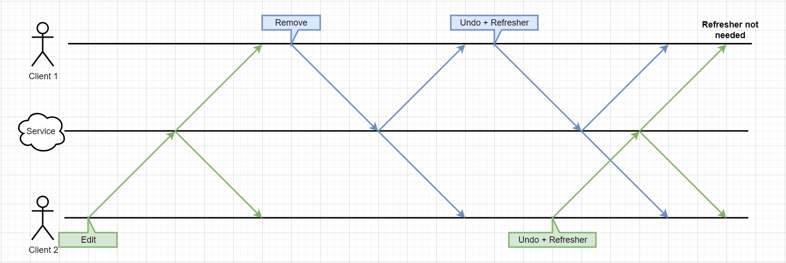
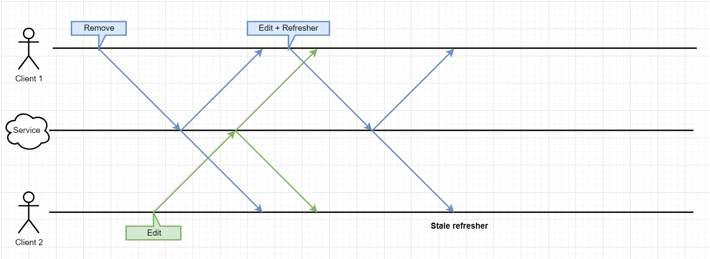

# Detached Trees

> Note: "detached trees" replaces the older term "repair data". The more general term is preferred because detached trees are relevant beyond undo/redo.

## What are Detached Trees?

When SharedTree edits remove or overwrite nodes, the operation is non-destructive: the node is moved out of the document tree into a detached state rather than erased. Its contents remain in the forest as a separate root — "detached" from the document.

## Does This Lead to Unbounded Memory Growth?

Keeping all detached trees forever would cause unbounded memory growth and snapshot bloat. To avoid this, detached trees are garbage collected. Most systems are designed to ignore this GC, keeping their contracts and implementations simpler.

## When Are Detached Trees Relevant?

Detached trees are needed when a removed subtree's contents become relevant again:

- Updating `TreeCheckout` after reverting a commit
- Updating `TreeCheckout` after aborting a transaction
- Updating `TreeCheckout` after rebasing a local branch
- Updating `TreeCheckout` after merging in a rebased commit

### After Reverting a Commit

Reverting a remove or set operation requires the previously removed/overwritten tree. See [V1 Undo](./v1-undo.md).

### After Aborting a Transaction

When a transaction is aborted, its edits are rolled back. If any removed nodes during the transaction must be reintroduced to the document tree.

### After Rebasing a Local Branch

When a peer edit is sequenced before a local edit, the local state must be updated to reflect not just the peer edit but its effect on the local edit.

Example:
- Local edit: Remove node B if A exists.
- Peer edit (sequenced first): Remove node A.

After rebasing, the local edit's constraint is violated — B should not have been removed. To reach the correct state from the local tip (both A and B removed), B must be restored, requiring its detached contents.

### After Merging In a Rebased Commit

An edit targeting an in-document tree may be rebased over the removal of that tree or an ancestor, making it target a detached tree. Applying such an edit requires access to the detached tree's contents.\*

\* Strictly, this only applies to edits that move content from a detached tree back into the document. Other edits to detached trees could theoretically be ignored since users can't see their effect. We conservatively don't exploit this, as the added complexity isn't worth it.

## Why Design It This Way?

### Merge Semantics

Our merge semantics and undo/redo allow edits to affect removed trees — removed trees remain part of the shared content. Treating them as persistent throughout the system is consistent with this.

### Performance

The alternative — eagerly erasing removed subtrees — requires that removal operations carry a copy of what they remove. This imposes a cost on every removal, even when the data is never needed. The opposite extreme (retaining all detached trees forever) causes unbounded snapshot and memory bloat. Our approach is a middle ground, with room to fine-tune the trade-off via the [undo window](undo.md) concept.

### Simplicity

Most of the system treats all trees as existing forever, which simplifies those systems. The GC complexity is confined to a small, dedicated body of code.

This approach lets SharedTree be viewed as two sub-DDSes:
- One managing node existence (new nodes created; nodes never deleted but clients can forget them; clients can refresh each other on detached node existence)
- One managing node location (nodes can be moved, including removal and restoration)

### Evolvability

The refresher system (described below) accommodates future features like the [undo window](undo.md) (which simply delays GC further) and partial checkouts (where content moved into a checked-out region from outside it could be treated similarly to detached trees).

## How it Works

### Identifying Detached Trees

Detached trees must be identifiable across three layers:

- Changesets
- Deltas
- `Forest` and `AnchorSet` `DeltaVisitor` calls

In-document trees are identified by their path from the document root. Detached trees need a separate scheme at each layer.

#### In Changesets

Changesets are sent over the wire and rebased, so peers need a globally consistent identification scheme. We use `ChangeAtomId`s: each detached tree is associated with exactly one `ChangeAtomId`, determined by the changeset that last detached it. Since all clients share a consistent view of changesets (via rebasing), they derive consistent `ChangeAtomId` assignments.

#### In Deltas

Deltas use `DetachedNodeId`s — a copy of the `ChangeAtomId`s from changesets. Global consistency is not required for deltas; different clients may use different IDs for the same tree. A single client must be internally consistent: 1:1 correspondence between a detached tree and a `DetachedNodeId`, stable over time. (A tree that is detached, reattached, and re-detached may be assigned a new `DetachedNodeId`.)

#### In `DeltaVisitor` Calls

`Forest`, `AnchorSet`, and `DeltaVisitor` don't have a concept of detached trees. At this layer, detached trees are identified by a path starting in a detached field (the same kind of field that contains the document root). A translation layer — `DetachedFieldIndex` — maps `DetachedNodeId`s to these paths. This keeps the abstractions simpler at the cost of the translation layer.

### The `DetachedFieldIndex`

`DetachedFieldIndex` is used primarily by `visitDelta` to translate `DetachedNodeId`s to forest paths. Core responsibilities:

- Assign a path to a newly detached tree (given its `DetachedNodeId`)
- Look up the path for an existing detached tree

#### A Naive Scheme

A trivial implementation would be:
```typescript
function detachedNodeIdToPath(id: DetachedNodeId): UpPath {
	const parentField = `detached-${id.major}-${id.minor}`;
	return { parent: undefined, parentIndex: 0, parentField };
}
```

Drawbacks:
1. High overhead per detached tree in scenarios with many small trees (e.g., text editing), because the forest must store a string key per tree.
2. Assumes we can dictate to forests how to identify detached trees — currently true, but we may want to allow forests to choose their own scheme.

#### The Current Scheme

`DetachedFieldIndex` introduces `ForestRootId`s as an indirection layer between `DetachedNodeId`s and forest paths. Each detached tree has a `DetachedNodeId` → `ForestRootId` → path mapping.

`ForestRootId`s are consecutive integers assigned as new detached trees are registered. Benefits:
- Small integers are cheap to store.
- Consecutive values are well-suited for run-length encoding.
- The arbitrary assignment is encapsulated in `DetachedFieldIndex`, leaving room for forests to assign them in the future.

The indirection also allows `DetachedFieldIndex` to pack multiple detached trees into a single detached field, amortizing the cost of storing the field key. In principle all detached trees could share one field, but the mapping complexity would outweigh the benefit. The optimal packing depends on editing patterns; the key point is that this is encapsulated and revisable.

### GC and Refreshers

Retaining detached trees forever causes:
1. Unbounded client memory growth.
2. Unbounded snapshot size growth (affecting service costs and load times).

#### Which Detached Trees to GC?

The cases where detached trees are needed (a–d) determine how long they must be retained:

- **(a) After reverting a commit:** As long as the host holds a `Revertible` for an edit that detached/edited the tree.
- **(b) After aborting a transaction:** As long as the transaction is open.
- **(c) After rebasing a local branch:** As long as the detaching edits remain on the branch.
- **(d1) After merging a rebased local commit:** As long as the detaching edit remains on the branch.
- **(d2) After merging a peer commit with ref-seq < detach seq:** As long as the min ref-seq is below the detach seq.
- **(d3) After merging a peer commit with ref-seq ≥ detach seq:** Forever.

Case (d3) shows that GC'ing any detached trees requires the peer to include a copy of the tree in their commit (a "refresher"). For cases (a)–(d2), GC'ing a tree we can't recover would be unacceptable — and while (d2) recovery is theoretically possible (re-fetch snapshot + replay), it would be slow and add service load.

**Policy:** Do not GC trees that fall under cases (a)–(d2). This simplifies to:

- Track the most recent commit that detached or edited each detached tree.
- GC the tree when that commit is trimmed from the trunk by `EditManager`.

This works because:
- `EditManager` doesn't trim commits that may still need rebasing.
- Commits on a branch won't be trimmed while the branch exists.
- In-flight commits (those peers may not have seen) are preserved in a branch.
- Each `Revertible` is backed by a branch containing its commit.

This policy sometimes delays GC slightly beyond the minimum, which is acceptable. A stricter policy could be designed if the memory savings justified the complexity.

#### Detached Tree Refreshers

A refresher is a copy of a detached tree included by a peer in a commit submitted to the sequencing service. Refreshers are not needed for internal branch commits — only for commits submitted (or resubmitted) to the service. (See `SharedTreeCore`'s `BranchCommitEnricher`.)

##### Including Refreshers

Given the GC policy, refreshers are needed for each detached tree whose contents are required to apply the commit and whose detach operation was already known to the peer.\* Refreshers are added immediately before submission; for resubmissions, they must be updated before resubmit. (See `SharedTreeCore` and `ResubmitMachine`.)

\* A refresher can be omitted if both: (1) the client has already sent a commit that would keep the tree in peers' memory (a detach or edit of the detached tree), and (2) that commit has not yet been received back from the sequencing service. In this scenario peers are guaranteed by the GC policy to still hold the tree.



##### Applying Refreshers

When applying a commit with refreshers, each refresher must be checked:

1. **Is the detached tree actually needed?** It may have been concurrently restored (reattached). If so, the refresher must be ignored.

   

   *(Ignoring is a requirement, not just an optimization: creating the detached tree would claim a `ChangeAtomId`/`DetachedNodeId` that may be needed if the now-attached tree is later detached again, violating the 1:1 ID-to-tree relationship.)*

2. **Does the detached tree already exist in memory?** It may not have been GC'd yet (e.g., a local branch still references it). If so, the refresher must be ignored — and must not overwrite the existing copy, which may be newer.

   

   Example: Client 1 removes a tree; Client 2 concurrently edits it; Client 1 then edits the detached tree and includes a refresher. Before Client 1 receives Client 2's edit, Client 1's refresher reflects the pre-edit state. If Client 2 still has the tree in memory, it must not overwrite it with Client 1's stale copy.

## Future Work

### Collecting Usage Data

To validate that the refresher system provides a good trade-off, we need telemetry:

1. Peak per-client memory overhead (forest + detached field index + untrimmed commits)
2. Peak snapshot size overhead (forest + detached field index + refreshers in recent/tail messages)
3. Total message size overhead from refreshers

For each metric, the percentage of overall cost is also useful (a 10MB overhead is fine atop 1GB but not atop 1KB).

These can be compared against alternative policies:
- Retain all detached trees forever.
- Retain none; include a full copy in every removal commit.
- Retain detached trees for the minimum time + K sequenced edits.

The last option helps assess the value of the undo window system and inform a good K value.

We should also measure the impact of omitting refreshers in the superfluous-refresher scenario described in [Including Refreshers](#including-refreshers).
