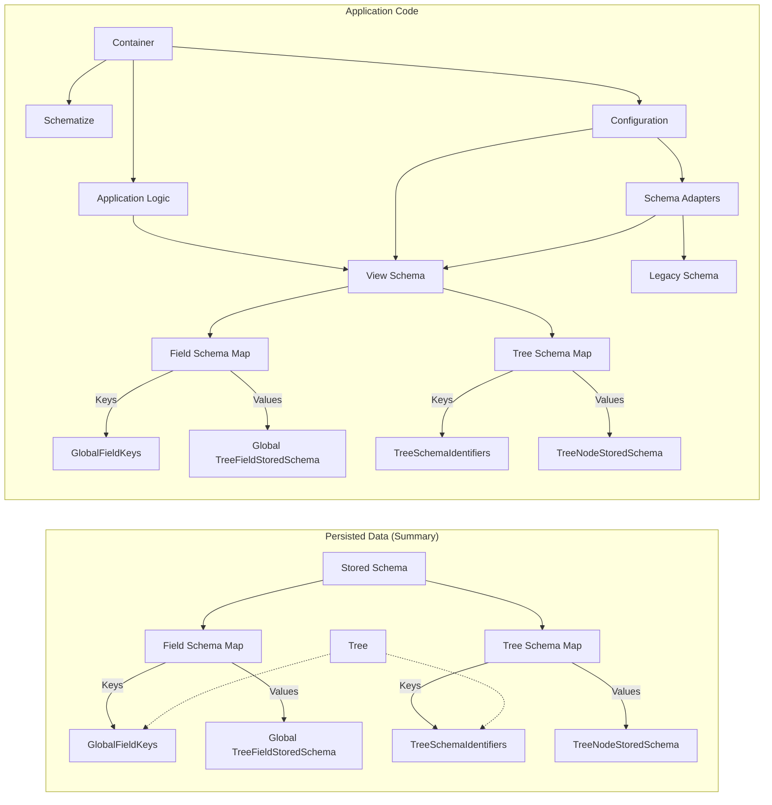

# Stored and View Schema

This document covers our chosen design from the design space defined by [Stored and View Schema Options](./stored-and-view-schema-options.md).

The diagram below shows schema-related data for a typical FluidTree application. Edges show dependencies/references.



View Schema (application code) can include TypeScript types. Stored Schema (document data) cannot.

On container load, Schematize uses Schema Adapters to present the document tree (conforming to Stored Schema) as a tree conforming to the View Schema, enabling type-safe schema-aware access.

## Schema Evolution Design Pattern

**If existing data is compatible with the new schema** (new schema permits a superset of what the old one did):

- Update the view schema to accept the new format while still supporting the old.
- Ensure the app handles documents containing the new format but does not yet write it. Options (TODO: pick one):
  - Use the new schema as the view schema; edit carefully.
  - Support both view schemas and have Schematize pick based on the stored schema.
  - Condition new-format writes on a flag initialized from stored schema compatibility.
- Wait for the above to be deployed to most users.
- Update the app to write the new stored schema and enable the new functionality.

**If existing data may be incompatible with the new schema:**

- Author a new schema with a new type identifier.
- Add support for it in the application (optionally use it as the view schema, providing Schematize with a migration handler).
- Apply the above algorithm to the parent schema (usually hits the compatible case).

### Schema Versioning

This migration strategy produces two kinds of schema changes:

1. An updated copy with a new type identifier.
2. An updated copy with the same identifier that tolerates strictly more trees.

In both cases, keeping the old schema in source is useful but for different durations.

**Case #2:** Keep only until migration completes (deployed apps may write the new format). During migration, keep both and test that the new schema is a superset. Afterward, delete: the old schema, code that creates data in the old format, and the superset test. Naming convention: `*CompatibilitySchema` (old) and `*Schema` (new). The new schema may be expressed as a declarative relaxation of the old one, then replaced with a standalone implementation when the old one is deleted.

**Case #1:** Keep forever to support old documents. Schemas have different identifiers (UUID or versioned name). The old schema plus upgrade adapters are packaged into a legacy library loaded by Schematize. The old schema need not appear anywhere else in source code (though it may appear in documents).

### Schema Migration Examples

Using schema pseudocode:

Starting schema:

```typescript
// Identifiers shown as version suffixes for clarity.
Canvas: CanvasV1 {
    items: Circle | Point
}

Circle: CircleV1 {
    center: Point
    radius: number
}

Point: PointV1 {
    x: number
    y: number
}
```

New view schema (changing `radius` to `diameter`):

```typescript
Canvas: CanvasV1 {
    items: Circle | Point // Now implicitly refers to CircleV2
}

Circle: CircleV2 {
    center: Point
    diameter: number // Changed from radius
}

Point: PointV1 {
    x: number
    y: number
}
```

Legacy support package:

```typescript
// Original canvas schema (Case #2: kept until migration finishes)
CanvasCompatibility:CanvasV1{
    items: CircleV1 | Point
}

// Original circle schema (Case #1: kept forever)
CircleV1:CircleV1{
    center: Point
    radius: number
}
```

With `CircleV1`, provide an adapter for Schematize that upgrades `CircleV1` when `CircleV2` is expected.

## Open Questions

### How to deal with rebasing of schema changes?

Schema changes can be concurrent and need rebasing. This requires careful design to avoid schema violations and to provide a sensible API for handling conflicts (e.g., a schema change that gets reverted). This also complicates the monotonic "schema changes only relax constraints" approach, which may be worth reconsidering.

### How to deal with transient out-of-schema states while editing?

Use edit primitives that avoid this? For example: swap instead of remove+insert, or a detach variant that inserts a placeholder requiring replacement with valid data before the transaction ends (though this may complicate the tree reading API mid-transaction).

### Do we need bounded open polymorphism?

Definitions:
- **unbounded/bounded:** whether all types are permitted, or constrained (by explicit list, structural interface, or nominal interface)
- **open/closed:** whether a new type can be used in a field without modifying the field's declaration

The current schema system has bounded closed polymorphism (unions in fields) and unbounded open polymorphism (unconstrained fields), but not bounded open polymorphism. This can be added in the future without breaking existing documents, so it is deferred. See `TreeFieldStoredSchema.type` doc comment for details.

## Approaches for Bounded Open Polymorphism

**Key distinction:** We care about enabling bounded open polymorphism at the application level, not necessarily in the schema system directly. Applications may want to constrain types based on application capabilities (e.g., what the app can draw), not data shape. Some patterns are achievable at the app level without schema system changes.

**Application-level approaches:**

- **Computed closed type sets at build/load time.** The app computes which types meet its requirements (structurally, nominally, or behaviorally) and programmatically constructs a closed schema. Different apps may produce different sets, so this is mainly suited to view schema. Options for stored schema:
  - Use the same schema as view schema initially, update later.
  - List only the types actually used in the document; update the field schema when new types are inserted.
  - Use open polymorphism in stored schema.

- **Hand-coded type lists.** Similar to above, but statically maintained. Build errors can catch missing updates; practical when all allowed types are known at build time.

- **Open polymorphism everywhere.** Handle unexpected values in the app.

- **Nominal open polymorphism in the schema.** Types explicitly declare membership in named typesets/interfaces. Stored/view schema compatibility checks can include verifying these align.

- **Structural constraints on field children.** Design choices:
  - Depth: apply constraints recursively or only to immediate children.
  - Target: types (all possible values of the type meet the constraint) vs. values (this particular instance meets the constraint). Value-based constraints add context-dependence and complicate stored schema enforcement and concurrent-move interactions.

## Inheritance Notes

Inheritance conflates nominal bounded open polymorphism with declaration/implementation reuse. Separating these aspects enables a more flexible system.

Inheritance can be useful for concise type expression; it can be implemented as syntactic sugar combining a reuse mechanism (e.g., including fields from another type) with a bounded open polymorphism mechanism (from the approaches above).

# Schedule

## M2

Review and polish the [Schema Migration Design Pattern](#schema-evolution-design-pattern) including actual APIs, documentation, and examples so apps can begin planning forward compatibility. Nail down concrete answers for flexible design areas (primitives/values and the initial set of primitive types).

## M2 or M3

Implement enough functionality to execute the steps in the design pattern.

## M3

Finalize the schema language, schema-aware APIs, and static typing. Ensure APIs keep data in schema (fuzz testing and/or proofs).

## Sometime after M3

Schema/shape-optimized storage formats. Additional functionality (prioritize based on users):

- Other stored schema options
- Imperative extensions to view schema
- More specific multiplicity options
- Helpers for schema migrations
- Bounded open polymorphism support/helpers
- App-use metadata in view (and maybe stored) schema
- Default values (stored schema compression hints; optional-field-as-value-field patterns; constants system)
- Enum helpers and patterns

# Misc Notes

## Schema DDS

The stored schema could live in its own DDS, especially if cross-DDS transactions are supported. The tree DDS could optionally be configured with a schema DDS for its stored schema, enabling shared schema across documents. Even without a separate DDS, the code should be structured to make a schema DDS easy to extract.

## TypeScript Typing

A [typebox](https://www.npmjs.com/package/@sinclair/typebox)-style embedded DSL for schema declaration can produce both compile-time types and runtime schema data, enabling schema-aware APIs without code generation. This could be extended further (though not necessarily usefully) to provide:

- A `SchemaRegistry` collecting both runtime and compile-time type data.
- Type-safe schema update APIs.
- Typed document load/viewing (e.g., type-check that the view supports the expected stored schema, with strongly typed adapters/reencoders for Schematize).

Regardless of TypeScript typing, stored schema can be checked against view schema to skip Schematize where possible. Schema supersetting can determine whether a schema is safe for reading but not writing.

## Reuse and Polymorphism

This document covers where schemas are stored and how they are used, not the specifics of what they do (i.e., what FluidTree needs from a schema system and what design options that leaves open — not how to build the schema system itself).
