# Fluid DDS Storage: Virtualization and Incrementality

> Note: Many terms link to the [Glossary](#glossary) at the end of this document the first time they are introduced. Items in a blockquote provide helpful context but are not strictly necessary to understand a topic.

## Overview

This document discusses options for efficient, large-scale tree-structured storage in a Fluid DDS, with the primary goal of supporting documents that can grow much larger than client memory. SharedTree is an example DDS with this requirement. The architecture and API differ significantly from what is currently available to a DDS; ideally they would be introduced at the container level as a service available to any DDS.

## Virtualization and Incrementality

Existing Fluid DDSes assume documents fit entirely in client memory. This document introduces two techniques that drop this assumption: [virtualization](#glossary) (paging in portions of the document on demand) and [incrementality](#glossary) (uploading only the changed portion). Only a memory-fitting subset of the document need be available at any time; old data is paged out as new data is paged in.

> A client's working region could be expanded to disk via an on-disk cache (e.g. IndexedDB), but this doesn't fundamentally change the approach, since a document might fit in neither memory nor disk.

Allowing partial downloads of the tree has implications on the layout and structure of stored data, which this document explores.

> The downloaded region is always within a client's [partial checkout](#glossary) — a server-sanctioned working region. The server enforces that the client downloads and receives ops only for that area, enabling permission boundaries and efficiency. Implementing partial checkouts is outside this document's scope, but this document provides the fundamental building blocks for such an implementation.

## Blobs and Chunks

To allow virtualization and incremental writes, the DDS splits the tree into contiguous regions of nodes called [chunks](#glossary), stored in [blobs](#glossary) uploaded to the storage service. The Fluid runtime provides two blob kinds — summary blobs and attachment blobs — and this document has no preference between them, so long as a blob can be downloaded lazily on demand.

> Chunk size need not match blob size; multiple chunks may go into one blob. Different parts of the application may use different chunk sizes. For the storage layer, an entire blob's contents can be treated as a single chunk even if the actual encoding is a collection of adjacent chunks.

A [chunking algorithm](#glossary) is responsible for dividing the tree into chunks. For example:

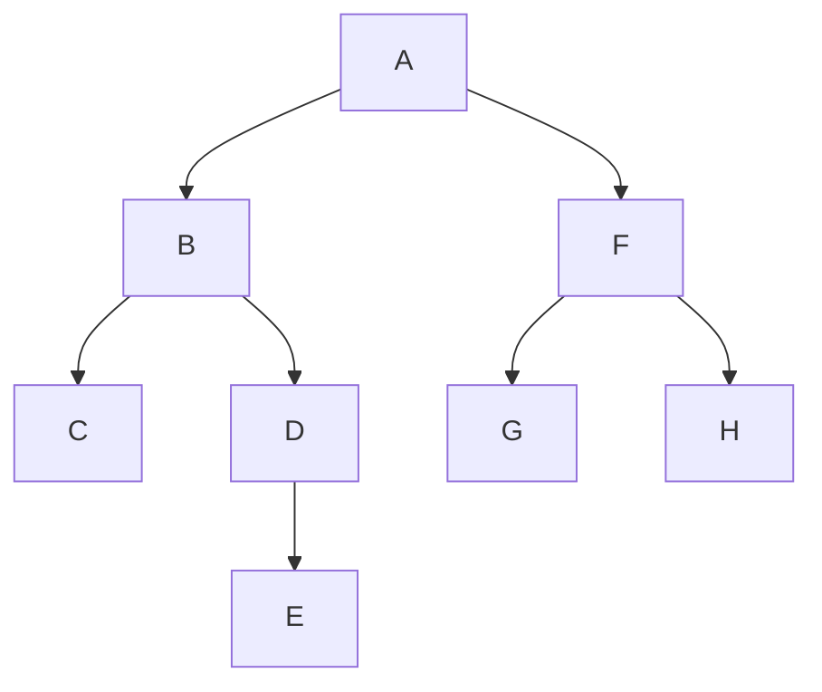

---

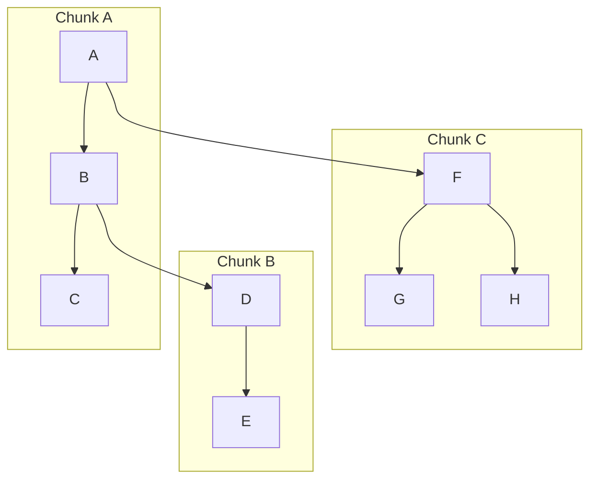

> In practice, chunks contain many more nodes than illustrated here.

Chunking algorithm implementation details are outside this document's scope. All chunking algorithms must satisfy:

-   All nodes in a chunk are contiguous
-   No two chunks intersect/overlap
-   Every node belongs to a chunk

> Chunking algorithms may be deterministic (same chunking for all clients) or tunable by client-specific parameters, depending on whether clients store chunks in memory or persistent storage and whether chunking is performed by one client or distributed across many.

## The Chunk Data Structure

Chunks contain references to the chunks below them in the tree. In the diagram below, Chunk A has a reference to Chunk B, and Chunk B has a reference to Chunk C:

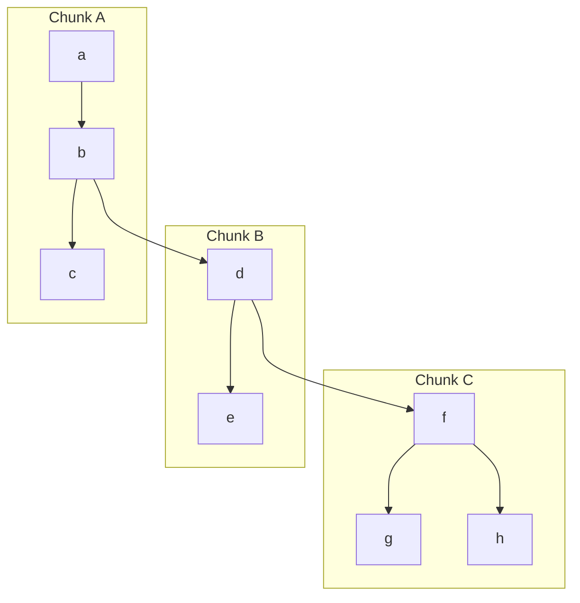

Node _b_ has two children: _c_ inlined in Chunk A (synchronous access) and _d_ in Chunk B (asynchronous, may require downloading Chunk B first). This is the virtualization pattern — chunks are loaded lazily on demand.

The chunks implicitly form another tree:

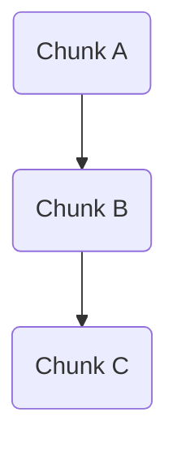

The following sections examine properties of this "chunk tree."

### Immutability

Blobs are immutable and [content-addressable](#glossary) throughout this document unless stated otherwise. Once created, a blob can never be updated — a new blob must be created instead, even if most of its contents are unchanged. The replacement blob has a different key (derived from its content hash), so any content referencing the old blob must also be updated.

Suppose Chunk A, B, and C are stored in Blob A, B, and C. Changing _h_ in Blob C requires replacing it with Blob C'. Since Blob C' has a different key, Blob B's reference to C is stale, so Blob B must become Blob B'. Finally, Blob A — which references Blob B — must also be replaced. This chain reaction ends at the root blob. Even though only Chunk C changed, all three chunks were replaced. In general, the entire [spine](#glossary) above any edited node must be replaced.

### Copy-On-Write History

Spine replacement has a useful side effect: tracking [revisions](#glossary) ([history](#glossary)) becomes trivial. Consider a tree of five chunks:

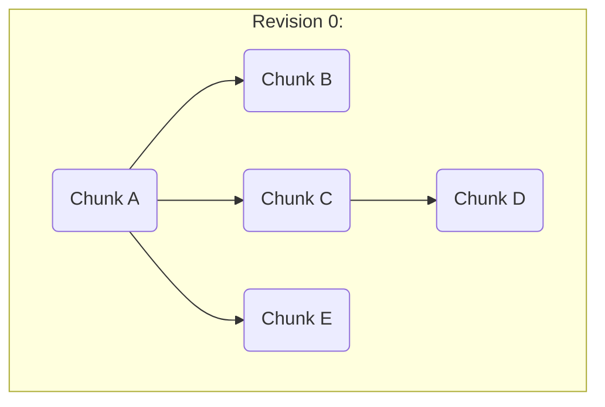

First, a client edits a node in Chunk B, so Chunk B and Chunk A (the spine) are replaced with Chunk B' and Chunk A', producing revision 1:

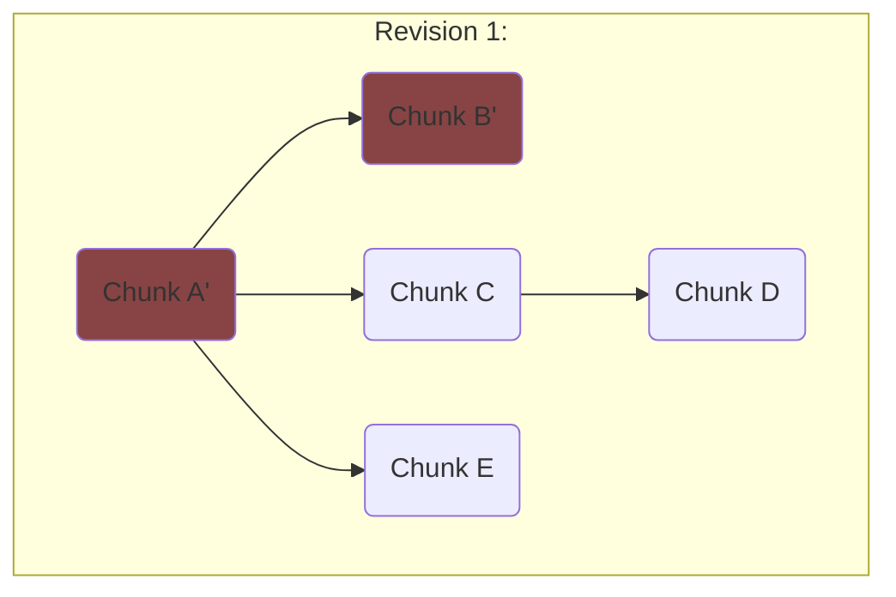

Next, the client [edits](#glossary) Chunk D, replacing A', C, and D to form revision 2:

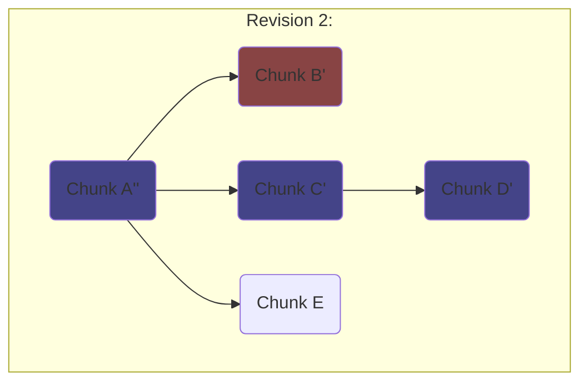

Chunks from all prior revisions remain in storage untouched. Walking down from the root chunk of any revision yields the complete tree state at that revision. Every revision produces exactly one new root chunk (every spine includes the root), so preserving history is just a log of root chunk keys:

| Revision | Root Chunk Key |
| -------- | -------------- |
| 0        | A              |
| 1        | A'             |
| 2        | A''            |
| ...      | ...            |

This forms a [copy-on-write](#glossary) data structure: each revision shares unchanged blobs with the previous, and the only cost is reproducing the spine's blobs. A chunk tree view from a given root is always stable — chunks never change as the client traverses, providing [snapshot isolation](#glossary).

### Server-side Blob Retention

Blobs must remain available long enough for clients to download them on demand. Documents retaining history require all blobs from all revisions to be available indefinitely. Documents without history retention need blobs available long enough for clients to reconstruct any needed revision — specifically, all blobs transitively referenced by summaries back to the most recent one before the session timeout threshold (30 days).

> If blobs are retained for 30 days after falling out of the current summary, an offline client can reconnect within that window. The revision from before disconnection may be needed to rebase ops created while offline.

Blob lifetimes are currently tied to their presence in the summary tree. If a summary stops referencing a blob, it is eventually deleted. For documents retaining history, the retained blob list grows unboundedly, increasing summary size indefinitely. Even without history, maintaining all "live" blob references can be awkward at scale.

One alternative: a mode where the server retains each blob indefinitely until the DDS explicitly requests deletion, giving the DDS full control over lifetimes.

A balanced alternative: the DDS informs the runtime when a new summary no longer uses a blob. The runtime waits until that summary is old enough (past the session timeout threshold) and then deletes the blob if no future summaries recreated or reused it.

### Write Amplification

The drawback of spine replacement is [write amplification](https://en.wikipedia.org/wiki/Write_amplification). Every write replaces every chunk on the spine above the edited node, incurring multiple sequential blob uploads per value update (each upload must wait for the key of the blob below it).

> Uploads could be parallelized if the client predicted blob keys using the same hashing algorithm as the server, treating the key as an integrity checksum.

The next section explores amortizing this cost across multiple edits.

> Later, we'll look at minimizing spine length. Approaches are explored in [Appendix A](#appendix-a-chunk-data-structure-implementations).

## Amortizing Writes

Even in the best case (one chunk update per write), this scheme uploads a blob on every write — unacceptable for high-throughput DDSes. One mitigation is proposed below.

### Write-Ahead Log and Intermittent Flushing

Upload cost can be reduced by uploading modified chunks periodically rather than after every edit. Each "[flush](#glossary)" uploads the union of all spines changed since the last flush:

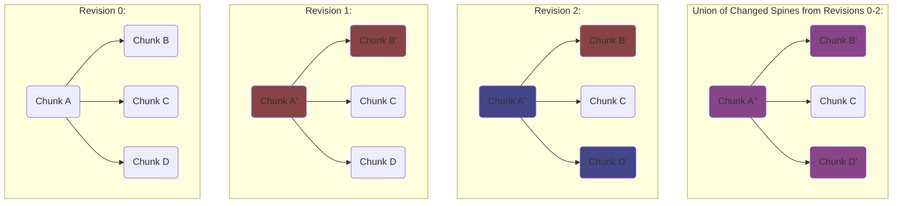

Between flushes, the client keeps edits in an in-memory log and computes the current state by applying log edits sequenced after the last flush. For example:

| Revision | 0   | 1   | 2   | 3   | 4   | 5   | 6   | 7   | 8   | 9   | 10  | 11  | 12  | 13  | 14  | 15  | 16  | 17  | 18  | 19  | 20  |
| -------- | --- | --- | --- | --- | --- | --- | --- | --- | --- | --- | --- | --- | --- | --- | --- | --- | --- | --- | --- | --- | --- |
| Edits    |     | A   | B   | C   | D   | E   | F   | G   | H   | I   | J   | K   | L   | M   | N   | O   | P   | Q   | R   | S   | T   |
| Flush    |     |     |     |     |     | \*  |     |     |     |     | \*  |     |     |     |     | \*  |     |     |     |     | \*  |

A client joining after edit 7 downloads chunks from the flush at revision 5 (containing edits A–E) and applies F and G to reach current state.

> In practice, flushes can be far less frequent. A client can choose a frequency optimized for its usage patterns, and flushes can run in the background without blocking incoming edits.

> This is similar to Fluid Framework summarization: a DDS has an ops log representing edits, and periodically a client uploads a summary representing cumulative state. A client only needs the latest summary plus ops after it to know the current state. Ideally the DDS would leverage summarization directly. Several current limitations prevent this:
>
> -   Summary trees do not currently support virtualization. A client must download all chunks on connect. Summary virtualization is in development and could eventually allow partial chunk downloads.
> -   Summary trees support incrementality via blob handles, but the API is not yet exposed to DDSes. An ongoing effort to automatically divide summaries into blobs also doesn't give DDSes fine-grained control over chunking boundaries.
> -   Summary frequency cannot be controlled by a DDS. Summaries happen across the entire container at once, so a DDS cannot independently optimize its flush frequency.
> -   Only one summary client is responsible for uploading at a time. For documents too large to fit in a single client's memory, a flush could exceed the summarization timeout as the client pages the tree in and out.

> This approach is analogous to copy-on-write filesystems like [ZFS](https://en.wikipedia.org/wiki/ZFS): updates accumulate in memory ("transaction groups" in ZFS) and are periodically flushed to disk, just like Fluid summaries. Edits are also recorded into a write-ahead log ("Intent Log" in ZFS) with lower latency to minimize data loss from crashes or disconnects.

Two options for log storage:

1. **In-memory log**: efficient append and eviction. New edits append; edits before a flush are evicted when that flush completes. The log can be serialized into and loaded from the Fluid summary by a summary client.
2. **Per-chunk log**: the log is split by the tree region each edit applies to and stored in the chunks themselves. Each chunk is self-describing (last flushed state plus edits to bring it current). Requires relaxing immutability to "append-only" blobs. When a chunk fills with edits, a flush occurs, incurring a spine update.

After a flush, all clients are notified with the new chunk root. An elected client (e.g. the oldest client or one chosen via Fluid quorum APIs) performs periodic flushes via a "flush op" containing the new chunk root. Because flushes take time, concurrent flushes need coordination. Two simultaneous flushes may both start; the second to finish would be conflicted and, if adopted, would incorrectly overwrite the first. To handle this, each flush op is tagged with the reference sequence number from when the flush began. A flush op is valid if and only if no other flush ops were sequenced between that reference sequence number and the flush op's own sequence number.

> For example, a conflicted scenario might resolve like this:
>
> 1. Client A, the elected flushing client, begins a flush. The latest sequence number delivered to Client A is 10.
> 2. Client B is elected to be the new flushing client.
> 3. Client B begins a flush. The latest sequence number delivered to Client B is also 10.
> 4. Both clients receive five more ops; both have latest known sequence number 15.
> 5. Client A's flush finishes uploading. Client A submits a flush op with the new chunk root handle and reference sequence number `10`.
> 6. The server sequences Client A's flush op at sequence number `16`.
> 7. Client B's flush finishes uploading. Client B submits a flush op with reference sequence number `10`.
> 8. The server sequences Client B's flush op at sequence number `17`.
> 9. Client A receives sequence number `16` (its own flush op) and acknowledges the new chunk state, updating caches and evicting now-unnecessary log edits.
> 10. Client B receives sequence number `16` (Client A's flush op) and acknowledges it. Client B also knows its own flush is conflicted (Client A's flush op was sequenced first), so it starts a new flush based on the updated state.
> 11. Both clients receive sequence number `17` (Client B's flush op). Both recognize it as conflicted — its reference sequence number `10` predates Client A's flush op at `16`. Both ignore it.

## Random Reads

Starting from the root chunk, reading a leaf requires downloading all chunks along its spine.

A [random read](#glossary) reads a specific node by [path](#glossary) without reading surrounding nodes. Practical examples: applications following "bookmarks" or "links" into the tree, initial reads of a partial checkout, or unrelated components querying disjoint tree paths. Such reads still download the entire spine sequentially (each chunk's download reveals the next chunk's key). While a client could implement this by walking the tree, a built-in random read API lets it benefit from the [Appendix A](#appendix-a-chunk-data-structure-implementations) optimizations that reduce spine cost for deep trees.

## Non-Random Access

Applications often read an entire subtree, sample small data from many subtrees (e.g., file names in a directory), or make many consecutive edits in one area. Optimizing these cases largely comes down to storing co-accessed data in the same or nearby blobs, enabling better write amortization, lower bandwidth, and faster reads. See [Appendix A](#appendix-a-chunk-data-structure-implementations) for more.

## Tree Shapes

Read and flush performance depend on spine length, which varies with tree shape. A wide, shallow tree requires few chunk reuploads per leaf edit:

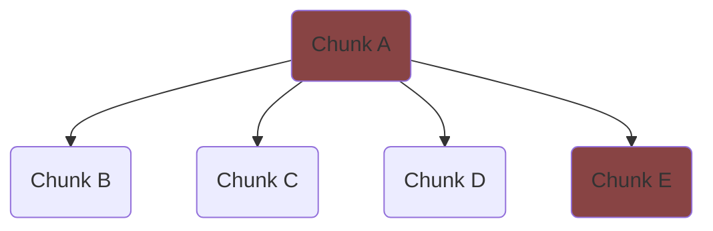

A write to E reuploads only two chunks: Chunk A and Chunk E.

> Leaf nodes are both farthest from the root and where applications store most data — they are the most commonly edited.

Deeper, narrower trees are more problematic:

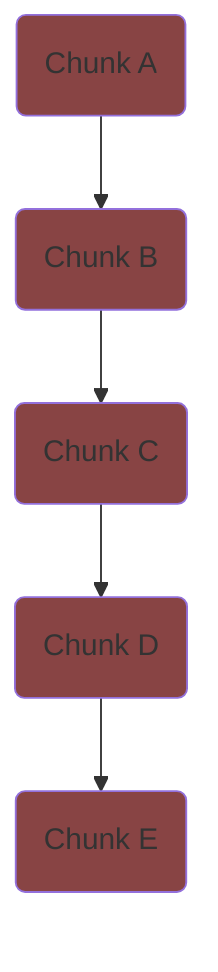

This tree has the same number of nodes and chunks as the previous, but editing a leaf requires five reuploads due to tree depth.

There is also a problem in the other direction: very long sequences of children under a single parent. Consider a logical tree with one million nodes under one parent:

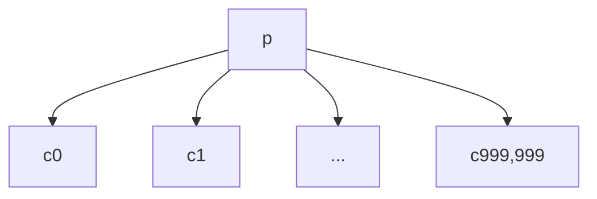

Divided into chunks of 100 nodes each:

```mermaid
graph TD;
    subgraph Chunk P
        p
    end
    subgraph Chunk 9,999
        p-->c999,900
        p-->c999,901
        p-->cx9[...]
        p-->c999,999
    end
    subgraph ...
        p-->cxx[...]
    end
    subgraph Chunk 1
        p-->c100
        p-->c101
        p-->cx1[...]
        p-->c199
    end
    subgraph Chunk 0
        p-->c0
        p-->c1
        p-->cx0[...]
        p-->c99
    end
```

This layout yields 10,000 chunks under Chunk P — more keys than Chunk P can likely store. A chunking algorithm cannot satisfy chunk size requirements without special handling. One solution is a data structure (itself divided into chunks) that arranges child chunks under the parent with efficient access by child index. [Appendix A](#appendix-a-chunk-data-structure-implementations) details such a structure: the ["Sequence Tree"](#sequence-tree).

Tree shape alone can significantly affect performance. The maximum spine length for a node is its depth divided by the minimum chunk height. In the worst case (a "[deepest tree](#glossary)" where depth equals node count), this is `O(N)`. Flushing a single spine can require `O(N)` uploads.

### Optimizing Tree Shapes

The worst case for both reads and writes is `O(N)` blob downloads/uploads. With a good chunking algorithm and non-pathological trees, most cases do far better — but the asymptotics are unattractive. Reorganizing chunks into a different hierarchy improves the worst case to `O(log(N))`. See [Appendix A](#appendix-a-chunk-data-structure-implementations) for an analysis of different chunk data structure implementations.

## Generalization

An open question is whether this architecture should be part of a specialized DDS or the Fluid Framework as a container-level service. Ideally any DDS could leverage the virtualized and incremental scalability described here. Such a service would provide:

-   A tree-like storage service accessible at any time, supporting virtualized node downloads and a mutation interface for incremental updates.
-   Configurable chunking strategy — different DDSes may want different regions downloaded together. A Simple Chunk Tree or SPICE Tree (see [Appendix A](#appendix-a-chunk-data-structure-implementations)) provides the necessary flexibility.
-   A canonical (but optional) way to store and query DDS history as a series of virtualized revisions.

A single storage tree shared among all DDSes (each owning a subtree) could provide container-level benefits:

-   All DDSes — and therefore the entire container — would scale with large data sets.
-   The service could track container-level revisions rather than just per-DDS revisions, enabling container-level snapshot isolation: any transaction views a consistent state for its lifetime regardless of other DDSes' activity.
-   This would be a significant step toward container-level history.

Such a service would reshape the summarization API: instead of producing a summary tree periodically, a DDS would flush any sequenced data not yet committed to storage. Alternatively, a DDS could write to storage at any time, with mutations buffered and flushed intermittently in the background.

## Appendix A: Chunk Data Structure Implementations

This appendix covers several high-level chunk data structure designs and their tradeoffs.

### Simple Chunk Tree

The simplest chunk data structure is a tree whose nodes are the logical tree's chunks — the structure implicitly analyzed so far. It has `O(N)` read and write performance but is simple to reason about. Consider the logical tree below, annotated with path edges:

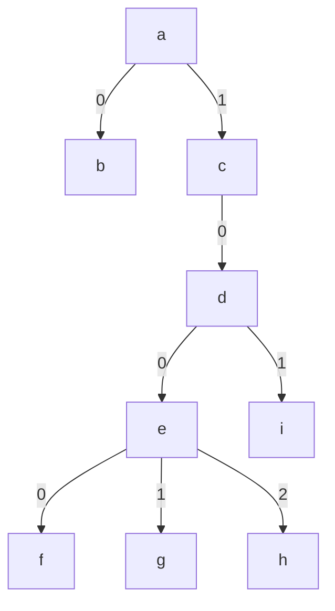

> The path to node _h_ is "1/0/0/2"

Chunked by a chunking algorithm:

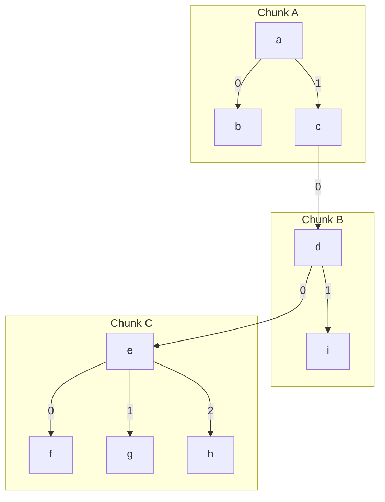

This implicitly forms a tree of chunks:

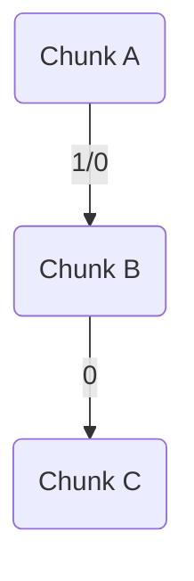

Logical tree edges concatenate to form chunk tree edges, enabling path-based lookups. For example, path "1/0/0/2" has prefix "1/0" (edge A→B), then "0" (B→C), then "2" pointing to node _h_ within Chunk C. This structure is simple but a deep logical tree produces a deep chunk tree with the same amplification problems discussed earlier.

---

Advantages:

-   Simple to implement and reason about, since it is directly derived from the logical tree.
-   Chunk boundaries can be chosen arbitrarily with few restrictions, allowing semantic grouping of related content to minimize network traffic.
-   Schema can hint at chunk boundaries. Intra-chunk descent is synchronous; crossing a chunk boundary is asynchronous, enabling a cleaner read API.

Drawbacks:

-   Poor performance for deep trees
-   Poor performance for large sequences of nodes under a single parent without a specialized data structure (see "Sequence Tree" below)

### Sequence Tree

The Sequence Tree addresses the case where a single parent chunk has many child chunks. A [B-tree](https://en.wikipedia.org/wiki/B-tree) family member, it organizes child chunks as leaves in a balanced tree, guaranteeing each child is at most `log(C)` hops from the parent where `C` is the number of children. It supports atomic range insert, remove, and move without per-node operations, and scales to any number of children — which a parent chunk generally cannot accommodate due to finite key storage space. The Sequence Tree has been successfully prototyped; implementation details are outside this document's scope.

A Simple Chunk Tree could use a Sequence Tree whenever a node's children exceed the single-parent threshold, giving ideal performance for that case — though this doesn't address deep-tree performance.

### Path-Based B-Tree

The Path-Based B-Tree replaces the Simple Chunk Tree entirely, also eliminating the need for the Sequence Tree. It stores all nodes in a key-value structure optimized for sorted keys, using each node's path as its key. Consider the same logical tree:


Node paths are sortable — sorted lexically, they produce an in-order traversal: `a`, `b`, `c`, `d`, `e`, `f`, `g`, `h`, `i`.

| Node | Path      |
| ---- | --------- |
| a    | "\_"      |
| b    | "0"       |
| c    | "1"       |
| d    | "1/0"     |
| e    | "1/0/0"   |
| f    | "1/0/0/0" |
| g    | "1/0/0/1" |
| h    | "1/0/0/2" |
| i    | "1/0/1"   |

> Other sorts are possible, but this one enables helpful B-tree optimizations (see Potential Optimizations below).

Sortability is the only requirement for B-tree keys, so each node's path and data can serve as key and value. With a branching factor of three, the B-tree might look like:

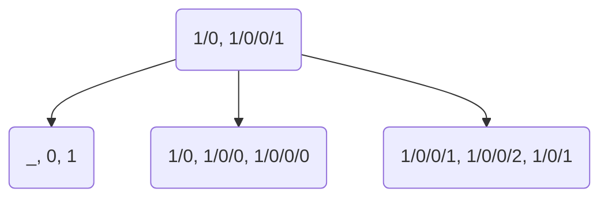

Each interior node fits in a single chunk, as does each leaf node:

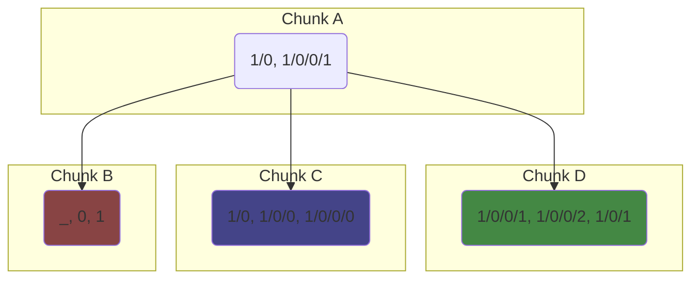

> These diagrams show only keys; node values can be stored inline or out-of-line in separate blobs depending on size. As nodes are added or removed, the tree rebalances automatically like any B-tree.

Every consecutive range of nodes in sorted order comprises a leaf chunk; interior nodes are in chunks too:

| Chunk | Nodes         |
| ----- | ------------- |
| A     | Interior Node |
| B     | [a, b, c]     |
| C     | [d, e, f]     |
| D     | [g, h, i]     |

The unbalanced logical tree is organized into a chunk tree with at most `O(log(N))` uploads/downloads per write/read, since B-trees remain balanced by definition. Even in this small example, the advantage is apparent: the spine to a leaf is two chunks in the Path-Based B-Tree versus three in the Simple Chunk Tree — differences that grow with tree depth.

> The path-based B-tree here has more total chunks than the simple chunk tree (four vs. three), requiring slightly more storage. However, that overhead also scales logarithmically and is negligible for trees with large branching factors.

---

Advantages:

-   Lookup of any node by path requires at most `O(log(n))` chunk downloads.
-   Editing a node requires at most `log(n)` chunk uploads.
-   Conceptually simple chunk boundaries — no structural analysis or special chunking algorithm needed; the "chunking algorithm" is just the B-tree algorithm.
-   A suboptimal implementation could use an off-the-shelf B-tree for quick prototyping, though production use would likely require a custom implementation for the optimizations below.

Drawbacks:

-   Inflexible chunking. Traversing some tree shapes requires jumping around the B-tree even when accessing logically adjacent nodes. No sort order or chunk size guarantees good locality for all regions of an arbitrary tree. Any node access may be asynchronous.
-   Significantly more complex to implement than the Simple Chunk Tree.

Potential Optimizations:

-   Path keys are always sub-paths of keys in the node above them. Eliminating this redundant shared prefix greatly reduces storage for keys, especially in deep trees. It also makes move operations more efficient, since B-tree nodes not containing the moved path segment don't need to change.
-   Deduplicate/intern repeated path sections within a B-tree node using a prefix tree on each node.

### SPICE Tree

The Spatially Partitioned, Ideally Chunked Entity tree allows the logical tree to be chunked arbitrarily, then organizes those chunks into multiple trees of varying detail that achieve the same `O(log(N))` asymptotics as the Path-Based B-Tree. Specifically: chunk the logical tree, then chunk the resulting chunk tree, then chunk that result — repeating until only one chunk remains. Consider a tree of nodes:

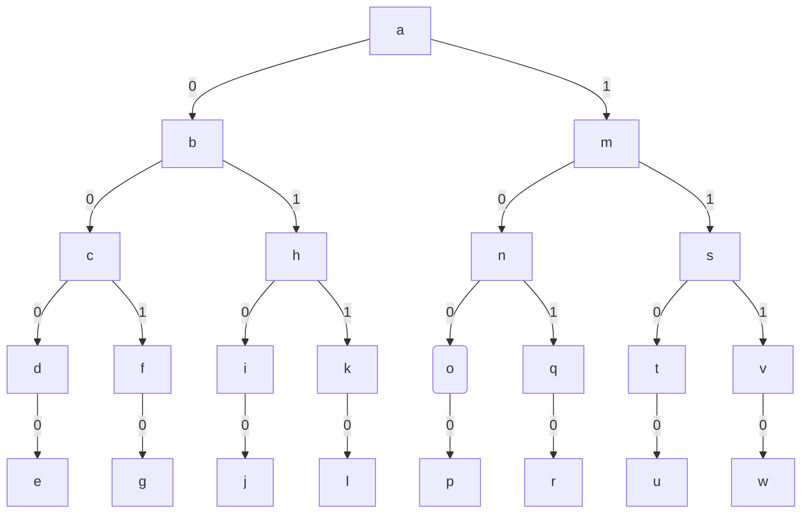

> The illustrations use a perfectly balanced tree with few nodes per chunk, but in practice neither need hold. Most trees requiring a SPICE tree will be far larger, unbalanced, and may put hundreds or thousands of nodes per chunk.

A chunking algorithm chunks it:

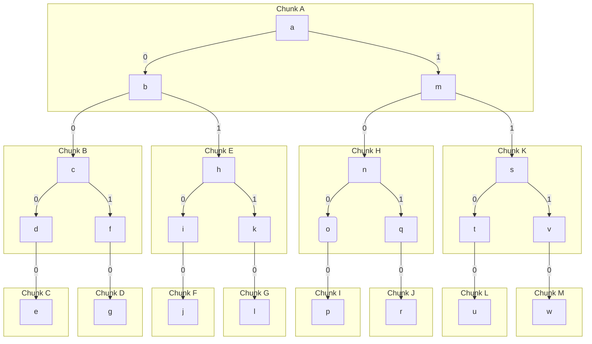

This yields the following chunk tree (a simple chunk tree):

```mermaid
graph TD;
    A--0/0-->B--0/0-->C
    B--0/1-->D
    A--0/1-->E--0/0-->F
    E--1/0-->G
    A--1/0-->H--0/0-->I
    H--1/0-->J
    A--1/1-->K--0/0-->L
    K--1/0-->M
```

| Chunk | Path to Chunk Root |
| ----- | ------------------ |
| A     | ""                 |
| B     | "0/0"              |
| C     | "0/0/0/0"          |
| D     | "0/0/1/0"          |
| E     | "0/1"              |
| F     | "0/1/0/0"          |
| G     | "0/1/1/0"          |
| H     | "1/0"              |
| I     | "1/0/0/0"          |
| J     | "1/0/1/0"          |
| K     | "1/1"              |
| L     | "1/1/0/0"          |
| M     | "1/1/1/0"          |

Next, the chunking algorithm runs again on the chunk tree rather than the logical tree:

```mermaid
graph TD;
    A--0/0-->B--0/0-->C
    B--0/1-->D
    A--0/1-->E--0/0-->F
    E--1/0-->G
    A--1/0-->H--0/0-->I
    H--1/0-->J
    A--1/1-->K--0/0-->L
    K--1/0-->M
    subgraph Chunk N
        A
    end
    subgraph Chunk R
        K
        L
        M
    end
    subgraph Chunk Q
        H
        I
        J
    end
    subgraph Chunk P
        E
        F
        G
    end
    subgraph Chunk O
        B
        C
        D
    end

```

The new chunks are labelled with their root chunk:

```mermaid
graph TD;
    N--0/0-->O;
    N--0/1-->P;
    N--1/0-->Q;
    N--1/1-->R;
```

| Chunk | Path  |
| ----- | ----- |
| N     | ""    |
| O     | "0/0" |
| P     | "0/1" |
| Q     | "1/0" |
| R     | "1/1" |

This chunking process repeats:

```mermaid
graph TD;
    subgraph Chunk S
        N--0/0-->O;
        N--0/1-->P;
        N--1/0-->Q;
        N--1/1-->R;
    end
```

Eventually the result is a single chunk:

```mermaid
graph TD;
    S
```

| Chunk | Path |
| ----- | ---- |
| S     | ""   |

The SPICE tree creates a ["level of detail"](<https://en.wikipedia.org/wiki/Level_of_detail_(computer_graphics)>) structure, analogous to a [quad tree](https://en.wikipedia.org/wiki/Quadtree), where the entire tree is queryable from a single root chunk _S_.

Each chunk's path label is a common prefix for the paths of all nodes it contains (or transitively contains). A lookup descends by matching labels against the target path. For example, looking up _p_ via path `1/0/0/0`: download _S_, find root chunk _N_ of the next layer. _N_ has children `0/0`, `0/1`, `1/0`, `1/1`; path begins with `1/0`, so follow to _Q_. _Q_'s root _H_ has children `0/0` and `1/0`; consume `0/0` to reach _I_. Download _I_ and find _p_ — done.

Each lookup traverses one chunk per layer, with one download per layer. Each layer differs from the previous by a roughly constant factor, so layers (and downloads) are logarithmic in tree size. SPICE tree spines contain `O(log(N))` chunks — the same as the Path-Based B-Tree.

---

Advantages:

-   Achieves path-based B-tree performance (`O(log(N))` uploads/downloads for random writes/reads) with simple chunk tree flexibility (arbitrary chunking by algorithm, schema-hinted boundaries).
-   Automatically handles the many-children-under-one-node scenario without a separate Sequence Tree — long sequences are progressively chunked into a B-tree-like structure by the same algorithm.

Drawbacks:

-   More complex to implement than the Simple Chunk Tree.

## Glossary

-   **Blob**: binary data uploaded to and downloaded from a storage service. Blobs are content-addressable and therefore immutable.
-   **Chunk**: a contiguous region of the tree. Every node belongs to exactly one chunk.
-   **Chunking Algorithm**: an algorithm that divides a tree into chunks.
-   **Content-addressable**: data whose key is derived from the data itself (e.g., a hash).
-   **[Copy-on-write](https://en.wikipedia.org/wiki/Copy-on-write)**: an immutable data structure that produces modifications by sharing unchanged state and copying only what changed.
-   **Deepest Tree**: a tree with N nodes and depth O(N) — a branching factor of 1, essentially a linked list.
-   **Edit**: an atomic change (or set of changes) applied to a tree, always producing a new revision.
-   **Flush**: writing a batch of changes to storage. Fluid Framework summarization is one example: ops are flushed into summary storage.
-   **Handle**: a serializable reference to a blob. Fluid handles cannot be created until the blob is uploaded.
-   **History**: the sequence of changes made to a tree over time. If a document needs history, it must be recorded in the summary, since the Fluid service only delivers ops after the most recent summary.
-   **Incrementality**: uploading or updating specific data in a collection without overwriting the entire collection.
-   **Logical Tree**: the actual tree of nodes/data making up a DDS's stored content. Used to disambiguate when multiple tree types are discussed.
-   **Partial Checkout**: a server-restricted region of the tree that a client operates within.
-   **Path**: a sequence of child nodes (and/or edges) walked from the root to reach a specific node.
-   **Random Read**: a query that retrieves a node without necessarily reading surrounding nodes (e.g., parents/siblings).
-   **Reference sequence number**: the sequence number of the latest known Fluid op when a client first sends an op.
-   **Revision**: a specific moment in tree history. Every permanent change produces a new revision.
-   **Sequence number**: the position of a Fluid op in the total ordering of all ops.
-   **Snapshot Isolation**: [a guarantee](https://en.wikipedia.org/wiki/Snapshot_isolation) that the view of data won't change until the client finishes its current edit.
-   **Spine**: the set of nodes forming the shortest path from a given node to the root.
-   **Virtualization**: downloading or paging in specific data from a larger collection without receiving the entire collection.
