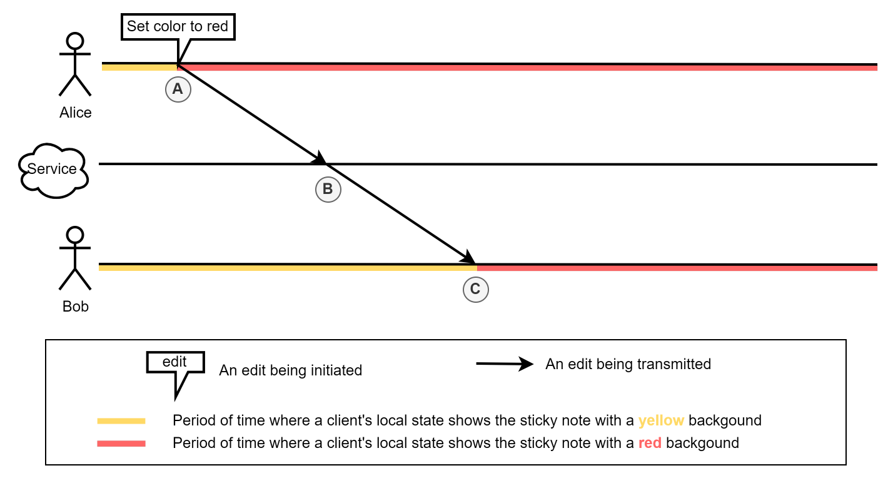
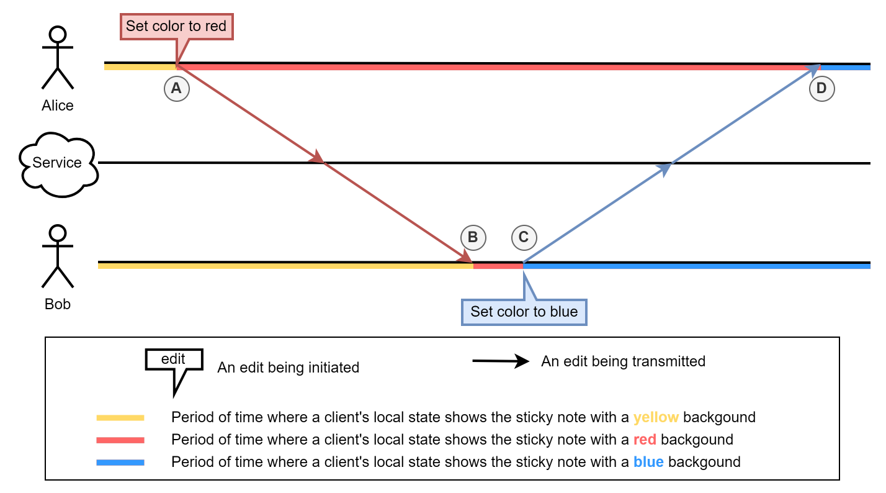
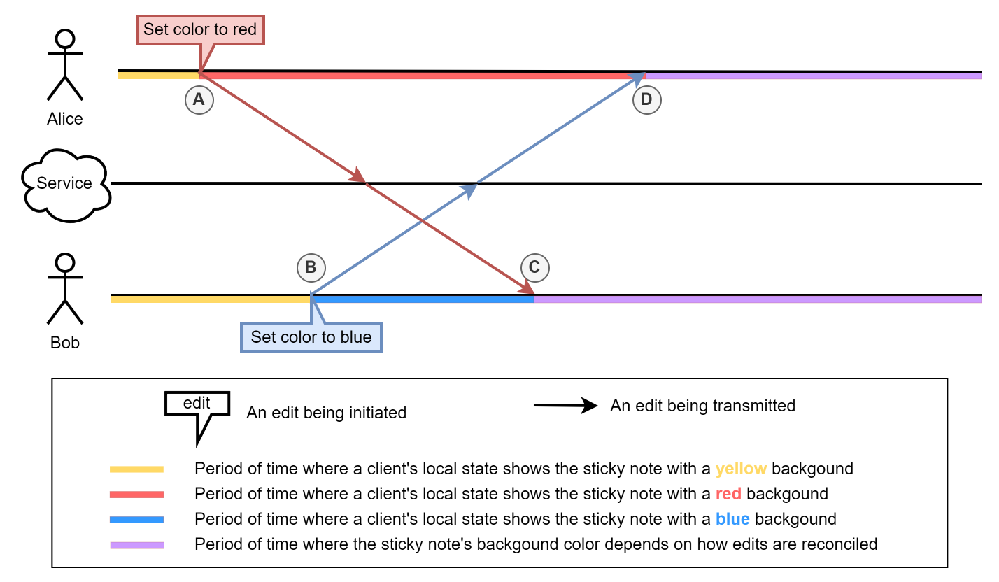

# SharedTree Merge Semantics

High-level description of `SharedTree`'s merge semantics for users and maintainers.

## What Are Merge Semantics?

Merge semantics define how `SharedTree` reconciles concurrent edits.

### Concurrent Edits

Edit `X` is concurrent with edit `Y` if the author of `X` initiated it before receiving `Y`. Concurrency is symmetric: if `X` is concurrent with `Y`, then `Y` is concurrent with `X`.

**Non-concurrent example:** Alice changes a sticky note's color from yellow to red. Bob receives that edit, then changes it from red to blue. No concurrency — Bob acted with full knowledge of Alice's change.

<br />
_A: Alice changes the note's color from yellow to red.<br />
B: The service forwards the edit to other users.\* <br />
C: Bob receives the edit; his view updates to red._

\* The service broadcasts to all users including Alice; that arrow is omitted from all diagrams for simplicity.

<br />
_A: Alice changes yellow → red.<br />
B: Bob receives the edit; his view updates to red.<br />
C: Bob changes red → blue.<br />
D: Alice receives Bob's edit; her view updates to blue._

**Concurrent example:** Bob changes the color from yellow to blue _before_ receiving Alice's yellow → red edit. Both edits are now concurrent.

<br />
_A: Alice changes yellow → red.<br />
B: Bob changes yellow → blue.<br />
C: Bob receives Alice's edit; the two edits are reconciled on his device.<br />
D: Alice receives Bob's edit; the two edits are reconciled on her device._

Reconciliation is covered in the next section. Fluid DDSes perform reconciliation on client devices — the server only orders and broadcasts edits.

### Reconciling Concurrent Edits

When concurrent edits affect independent parts of the tree, reconciliation is straightforward — each change applies independently.

When they overlap (as in the color example), multiple outcomes are possible:

-   change the color to red
-   change the color to blue
-   keep the color yellow
-   change the color to purple

`SharedTree`'s merge semantics define which outcome is chosen and guarantee all clients converge to the same result. Not all editing intentions can always be satisfied when they are incompatible.

## When Should You Care?

Most developers can use `SharedTree` without constantly thinking about merge semantics, but awareness is useful in two situations.

### Defining End User Experience

Application authors need to understand how their use of `SharedTree`'s editing APIs translates into user-visible outcomes during concurrent edits — both to achieve a desired experience and to know when that experience is achievable.

### Maintaining Application Invariants

Schema enforces most invariants, but some depend on merge semantics. For example, an app with two arrays that must stay the same length may find that concurrent edits violate that invariant even if the editing code always adds/removes from both arrays together. Understanding merge semantics helps anticipate or diagnose such violations and choose a remedy — such as switching to a single array of pairs.

## High-Level Design

### Edit Flow

`SharedTree`, like all Fluid DDSes, relies on a centralized service to order and broadcast edits. The service assigns a total ordering while preserving concurrency information. Merging is performed independently by each client, not by the service.

Each edit follows this path:

1. A client initiates the edit.
2. If invalid locally, the client throws and the edit is discarded.
3. The client applies the edit locally.
4. The client sends the edit to the service.
5. The service orders it relative to concurrent edits by arrival time.
6. The service broadcasts it to all connected clients.
7. Each client reconciles the edit with any concurrent edits already sequenced before it.
8. Each client applies the appropriate effects (if any).

For the originating client, steps 7–8 only adjust local state to account for concurrent edits sequenced before its own — it already applied the edit in step 3.

### A Conflict-Free Model

`SharedTree` never surfaces a "conflict" requiring manual resolution. It is closer to OT or CRDT systems than to [Git](https://git-scm.com/). Edits are applied one after another in sequencing order as long as they are valid. This works because `SharedTree` edits capture precise intentions, allowing `SharedTree` to accommodate all concurrent intentions or pick one to win when they are incompatible.

**Example:** A TODO app document:

```JSON
{
    "todo": [
        { "id": 1, "text": "buy milk" },
        { "id": 2, "text": "feed cat" },
        { "id": 3, "text": "buy eggs" }
    ]
}
```

Alice reorders items to group purchases; Bob concurrently renames item #2. These intentions don't conflict — `SharedTree` accommodates both: the reorder is preserved _and_ the text update applies to item #2 at its new position.

Git sees these as conflicting text diffs:

```diff
-               { "id": 2, "text": "feed cat" },
-               { "id": 3, "text": "buy eggs" }
+               { "id": 3, "text": "buy eggs" },
+               { "id": 2, "text": "feed cat" }
```

```diff
-               { "id": 2, "text": "feed cat" },
+               { "id": 2, "text": "feed Loki" },
```

Git's diff-based approach can represent any edit but cannot infer intent, so it requires human resolution. `SharedTree` trades that flexibility for automatic, intent-preserving reconciliation.

## How We Describe Merge Semantics

The merge semantics of an edit kind (e.g., moving a node) define its impact depending on what concurrent edits were sequenced before it. We describe this through **preconditions** and **postconditions**, which determine whether an edit is appropriate for a given scenario.

### Preconditions

Preconditions define what must be true for an edit to be valid. If they are not met, the entire transaction is dropped with no effect.

By default\*, `SharedTree`'s data edits have one precondition: the edit must not be concurrent with a schema change. Few preconditions are needed because removed content can still be edited (see [Removal is Movement](#removal-is-movement)).

\*Additional preconditions can be added via [constraints](#constraints). Understanding preconditions is a prerequisite for using constraints, but constraints can be ignored when reasoning about general merge semantics.

**Example:** Alice inserts a `Foo` node into an array. Concurrently, Bob changes the schema to disallow `Foo` in that array. Each edit has a precondition that the other's change hasn't happened. Whichever is sequenced first succeeds; the other is dropped.

The current insert precondition (no concurrent schema change at all) is broader than necessary — it drops inserts that wouldn't violate the schema. This is tolerable because schema changes are rare; a narrower precondition is planned.

Preconditions answer two questions:

1. Will this edit apply in all scenarios where I want it to apply?
2. Will this edit be dropped in all scenarios where I want it dropped?

When the answer to (2) is "no", [constraints](#constraints) can add the missing precondition. For example, to ensure Alice's color change always wins over Bob's, Bob's edit would need a precondition that the color hasn't been concurrently changed. `SharedTree` doesn't offer that built-in, but a constraint on the original value being unchanged is a workable alternative.

The preconditions of a transaction are the union of the preconditions of its edits.

### Postconditions

Postconditions define what is guaranteed to be true after an edit applies (given its preconditions are met). They capture the edit's intention. For example, a move edit guarantees the targeted node ends up at the destination — that is its intention.

Postconditions expressed as document state hold only immediately after the edit. Subsequent edits (concurrent or not) may move things further.

Postconditions answer two questions:

1. Will this edit have all the effects I want?
2. Will this edit have none of the effects I don't want?

If the answer to (1) is "no", a postcondition is missing or too narrow. For example, `SharedTree`'s array remove does _not_ guarantee the source array shrinks — nodes may have been concurrently moved elsewhere, and the remove still applies.

If the answer to (2) is "no", a postcondition is too broad. For example, map `delete` guarantees no node remains for the key — which is too broad if a node was concurrently set for that key and shouldn't be removed. [Constraints](#constraints) can invalidate the edit in such cases, but that drops the entire transaction; a narrower postcondition would only skip the deletion.

Within a transaction, later edits' postconditions override incompatible earlier ones. A node moved A → B, then B → C, ends up at C.

## High-Level Semantic Choices

`SharedTree`'s data model is built from object, map, and array nodes, each with its own editing API and merge semantics. A small set of system-wide design choices underpins all of them — understanding these is the most important part of understanding `SharedTree`'s merge semantics, and often makes the per-node-type details intuitive.

### Movement Is Not Copy

Moving a subtree preserves its identity — edits made to a subtree before or concurrently with a move still apply to the subtree at its new location. This is different from copy-then-delete, where a concurrent edit to the original would not carry over to the copy.

**Example:** Alice moves a sticky note to a new page; Bob concurrently edits the note's text. With move-as-identity semantics, Bob's edit is visible at the destination regardless of sequencing order.

### Minimal Preconditions

Except for [schema changes](#schema-changes), most edits share a single precondition: no concurrent schema change. This is intentional.

Permissive edits work in more situations. When stricter behavior is needed, opt-in [constraints](#constraints) add it. If edits had more preconditions by default, there would be no way to opt out — limiting expressiveness. The following subsections highlight key implications of this design.

#### Removal Is Movement

Removal (removing an array element, deleting a map key, or clearing/overwriting an object field) is treated as a move to an abstract "removed" location — consistent with `treeStatus()` returning `TreeStatus.Removed`.

**Example:** Alice removes a whole page of sticky notes; Bob concurrently moves one note from that page to another. Bob's note is preserved regardless of sequencing order — his move wins even if Alice's removal was sequenced first.

Modifications made to a subtree concurrently with its removal are preserved on the removed subtree. They become visible again if the removal is undone.

#### Last Write Wins

When concurrent edits represent incompatible intentions, the one sequenced last wins.

**Example 1 (color):** Alice changes a note yellow → red; Bob changes it yellow → blue. If Alice is sequenced first: yellow → red → blue. If Bob is sequenced first: yellow → blue → red.

**Example 2 (move):** Alice moves a note from X to A; Bob moves it from X to B. The note ends up at whichever destination was sequenced last. Because [removal is movement](#removal-is-movement), the same applies when one of the "moves" is a removal.

### No Conditional Postconditions

A conditional postcondition has the form "if \<condition\> then \<effect A\> else \<effect B\>". None of `SharedTree`'s current edits have them — every edit that passes its preconditions always produces the same effect.

**Why this matters:** Conditional postconditions are different from additional preconditions. A precondition that the node wasn't concurrently moved would drop the _entire_ transaction if violated. A conditional postcondition would only skip the removal and let the rest of the transaction proceed. Both are useful in different situations; `SharedTree` may support them in the future.

**Reasoning:** Unconditional postconditions make transactions predictable. Consider an app that selects N sticky notes and groups them on a new page with sequential ordinals. The transaction loops through the notes, assigns ordinals, and moves each to the new page. Regardless of concurrent edits (ordinal changes, moves, removals of parent pages), `SharedTree`'s semantics guarantee all N notes end up on the new page with ordinals 1 through N. With conditional postconditions, the new page could contain a subset of notes with gaps, duplicates, or out-of-order ordinals.

Formally: a transaction of N edits each with k<sub>i</sub> possible effects has k<sub>1</sub> × k<sub>2</sub> × … × k<sub>N</sub> possible outcomes. With k<sub>i</sub> = 1 for all edits (as in `SharedTree`), every transaction has exactly one outcome. With k<sub>i</sub> = 2, an N-edit transaction has 2<sup>N</sup> possible outcomes.

## Constraints

Constraints are opt-in preconditions added to a transaction to prevent it from applying when concurrent edits have made its effect undesirable.

**Example:** An app maintains two parallel arrays that must stay the same length. Removals are expressed as transactions that remove one element from each array. Starting from `{ arrayA: [a1, a2], arrayB: [b1, b2] }`, Alice removes `a1` and `b1` while Bob concurrently removes `a1` and `b2`. Without constraints, both transactions apply regardless of order, leaving `{ arrayA: [a2], arrayB: [] }` — a length mismatch.

Adding a constraint that the nodes to be removed must not already be removed fixes this. Now one transaction wins and the other is dropped:
- Alice sequenced first: `{ arrayA: [a2], arrayB: [b2] }`
- Bob sequenced first: `{ arrayA: [a2], arrayB: [b1] }`

### Supported Constraints

-   `nodeInDocument`: The targeted node must be present in the document (not removed).
-   `noChange`: The document must be in the same state when the transaction applies as when it was authored.

### Schema Changes

All edits/transactions have an implicit constraint: no concurrent schema change. Schema changes themselves have an additional constraint: no concurrent data change. This is tolerable because schema changes are rare. The merge semantics will be made less conservative in the future.

## Merge Semantics by Node Kind

- [Object Node](object-merge-semantics.md)
- [Map Node](map-merge-semantics.md)
- [Array Node](array-merge-semantics.md)
